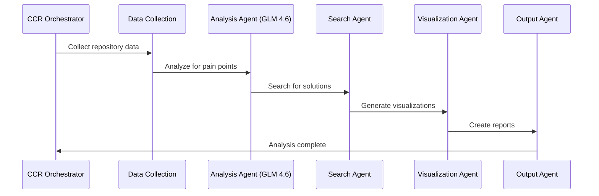

# Agentic Repository Analysis System - Prototype

## Overview

This prototype demonstrates an automated repository analysis system that uses agentic workflows with CCR (Claude Code Router) orchestration and GLM 4.6 for intelligent analysis. The system simulates a cron job that collects repository data, analyzes pain points, searches for solutions, and generates visualizations using Mermaid diagrams.

## Features

### Core Components

1. **CCR Orchestrator**: Simulates Claude Code Router for agent chaining and workflow management
2. **Multi-Model Support**: Integrates GLM 4.6, MiniMax, and Ollama models
3. **Data Collection Agent**: Mock GitHub API calls for repository data
4. **Pain Point Analyzer**: Uses GLM 4.6 for semantic analysis
5. **Search Agent**: Simulates DuckDuckGo API for solution research
6. **Visualization Agent**: Generates Mermaid diagrams (timeline, Gantt, flowchart)
7. **Side Agents**: Advanced insight detection and quality assurance
8. **Output Agent**: Generates comprehensive analysis reports

### Side Agent Framework

- **Insight Detection Agent**: Identifies critical insights requiring attention
- **Visualization Selection Agent**: Chooses optimal visualization types
- **Mermaid Generation Agent**: Creates clean, effective Mermaid code
- **Quality Assurance Agent**: Reviews visualizations for effectiveness

## Installation & Setup

### Prerequisites

- Python 3.8+
- Required packages: `requests`, `pyyaml`, `pathlib`

### Quick Start

```bash
# Clone or navigate to the repository
cd repo-analysis-system

# Make the runner script executable (Linux/Mac)
chmod +x run_prototype.sh

# Run the prototype
./run_prototype.sh

# Or run directly with Python
python agentic_prototype.py
```

### Configuration

Edit [`config.yaml`](config.yaml) to customize:

- API keys and endpoints
- Repository targets
- Model parameters
- Visualization settings
- Output directories

## Usage

### Basic Execution

```bash
# Run with default settings
python agentic_prototype.py

# Or use the shell script
./run_prototype.sh
```

### Advanced Options

```bash
# Clean old files and render diagrams
./run_prototype.sh --clean --render

# Verbose output
./run_prototype.sh --verbose

# Show help
./run_prototype.sh --help
```

## Output Structure

```
repo-analysis-system/
├── logs/                           # Analysis reports and logs
│   ├── prototype-run-YYYYMMDD-HHMMSS.md
│   └── prototype.log
├── review_logging/
│   ├── visualizations/              # Generated Mermaid files
│   │   ├── pr-timeline.mmd
│   │   ├── agent-workflow-gantt.mmd
│   │   └── pain-points-flowchart.mmd
│   ├── rendered/                   # SVG/PNG outputs (if mmdc available)
│   └── summaries/                 # Executive summaries
└── config.yaml                    # System configuration
```

## Sample Output

The prototype generates:

1. **Analysis Reports**: Comprehensive markdown reports with:
   - Executive summary with key metrics
   - Repository health overview
   - Pain point analysis with recommendations
   - Embedded Mermaid visualizations
   - System performance metrics

2. **Visualizations**: Three types of Mermaid diagrams:
   - **Timeline**: PR lifecycle analysis
   - **Gantt**: Agent workflow timeline
   - **Flowchart**: CI/CD pain point resolution

3. **Logs**: Detailed execution logs for debugging and monitoring

## Architecture

### Agent Workflow



### Model Selection Strategy

- **GLM 4.6**: Primary analysis for complex semantic understanding
- **MiniMax**: Quick triage for lightweight tasks
- **Ollama**: Privacy-sensitive analysis with self-hosted models

## Configuration Details

### API Configuration

```yaml
api_keys:
  github_token: "${GITHUB_TOKEN}"
  glm_api_key: "${GLM_API_KEY}"
  minimax_api_key: "${MINIMAX_API_KEY}"
  google_search_key: "${GOOGLE_SEARCH_KEY}"
```

### Repository Targets

```yaml
repositories:
  target_repos:
    - "ActuarialKnowledge"
    - "ui-mermaid-visualizer"
    - "ColdVox"
    - "Comfyuimodelmanagementdashboard"
    - "TabStorm"
    - "colossus"
    - "ui-jules-control-room"
```

### Visualization Settings

```yaml
visualizations:
  types:
    - "timeline"
    - "gantt"
    - "flowchart"
    - "sequence"
    - "xychart"
  
  limits:
    max_nodes: 20
    max_events_per_timeline: 7
    max_concurrent_tasks: 12
```

## Development

### Adding New Agents

1. Create agent class in appropriate module
2. Implement required methods
3. Register in CCR orchestrator
4. Update configuration schema
5. Add tests and documentation

### Extending Visualizations

1. Add new visualization type to `VisualizationAgent`
2. Update configuration schema
3. Implement Mermaid generation logic
4. Add quality assurance criteria

## Monitoring & Debugging

### Log Analysis

```bash
# View latest logs
tail -f logs/prototype.log

# Search for errors
grep "ERROR" logs/prototype.log

# Performance metrics
grep "Analysis Duration" logs/prototype-run-*.md
```

### Health Monitoring

The system tracks:
- Repository health scores
- Agent execution times
- Model usage statistics
- Error rates and recovery

## Production Deployment

### Cron Setup

```bash
# Add to crontab (every 6 hours)
0 */6 * * * /path/to/repo-analysis-system/run_prototype.sh

# Or use systemd timer
sudo systemctl enable repo-analysis.timer
sudo systemctl start repo-analysis.timer
```

### Environment Variables

```bash
export GITHUB_TOKEN="your_github_token"
export GLM_API_KEY="your_glm_api_key"
export MINIMAX_API_KEY="your_minimax_key"
export GOOGLE_SEARCH_KEY="your_google_search_key"
```

## Troubleshooting

### Common Issues

1. **Import Errors**: Install missing packages with `pip install requests pyyaml`
2. **Permission Denied**: Make script executable with `chmod +x run_prototype.sh`
3. **API Failures**: Check environment variables and network connectivity
4. **Missing Directories**: Script auto-creates required directories

### Debug Mode

```bash
# Enable verbose output
./run_prototype.sh --verbose

# Or modify logging level in config.yaml
error_handling:
  log_level: "DEBUG"
```

## Contributing

### Development Workflow

1. Fork the repository
2. Create feature branch
3. Make changes with tests
4. Update documentation
5. Submit pull request

### Code Standards

- Python 3.8+ compatibility
- Type hints for all functions
- Comprehensive error handling
- Logging at appropriate levels
- Unit tests for new features

## License

This prototype is part of the repository analysis system project.

## Support

For issues and questions:

1. Check logs in `logs/prototype.log`
2. Review configuration in `config.yaml`
3. Validate environment variables
4. Consult this README for common solutions

---

**Prototype Version**: 1.0.0  
**Last Updated**: 2025-11-13  
**Compatibility**: Python 3.8+, Linux/Mac/Windows