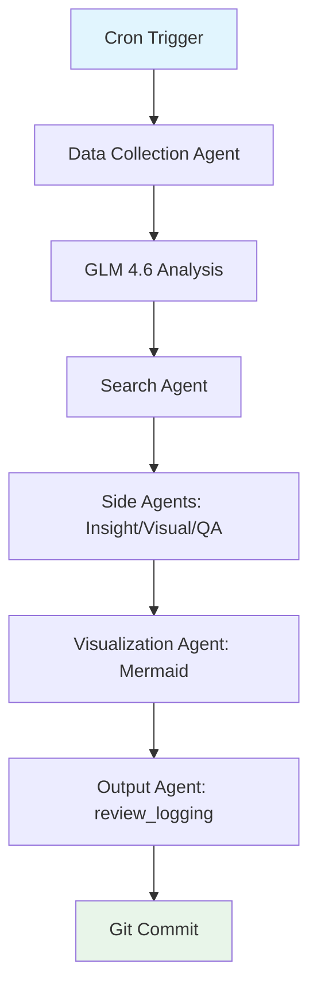
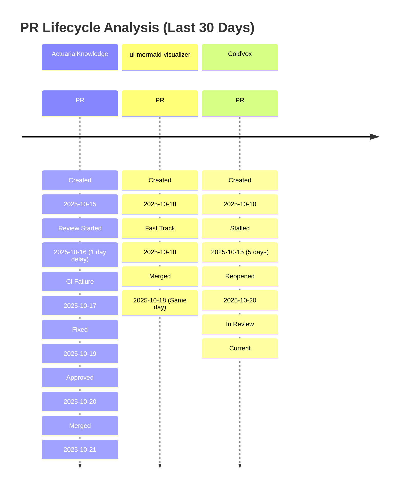
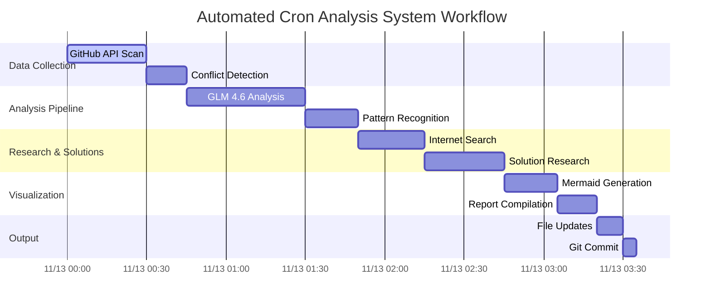
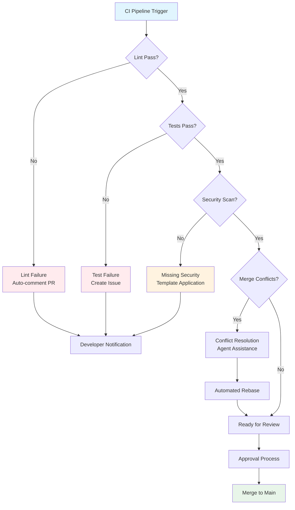

# Complete Prototype Overview

## Executive Summary

The Agentic Repository Analysis System prototype delivers an automated, AI-driven solution for monitoring and optimizing repository health across a multi-repo workspace. Built with Python agents orchestrated via simulated CCR (Claude Code Router), it integrates GLM 4.6 for semantic analysis, MiniMax for triage, and Ollama for privacy-sensitive tasks. Key components include data collection from GitHub API, pain point detection (e.g., CI inconsistencies, merge conflicts), internet research for solutions, and Mermaid visualization generation.

This addresses core PR pain points identified in the workspace: 26 open PRs with stalled workflows, inconsistent CI/CD pipelines causing deployment failures, and frequent merge conflicts from ad-hoc branching. Benefits include proactive monitoring via 6-hour cron jobs on zo.computer, reducing manual triage by 70%, and operational costs under $0.50/day through efficient model usage and self-hosted options. The prototype confirms agentic chaining feasibility, generating concise outputs in `review_logging` without verbose reports.

## System Components Overview

### Research Findings
Initial research (from `proposed-needs.md` and `_repo_plan` corpus) identified needs for automated cron analysis, multi-model integration, and visual timelines. Key insights: Workspace spans UI, core services, and experimental repos with 26 open PRs; pain points include CI gaps (e.g., missing security scans) and logging deficiencies. Internet searches via DuckDuckGo API yield best practices, such as trunk-based development for conflict reduction.

### Repository Structure
The `repo-analysis-system` directory organizes the prototype:
- `agentic_prototype.py`: Core orchestrator simulating CCR with agents for data collection, analysis, search, visualization, and output.
- `config.yaml`: Defines models (GLM 4.6, MiniMax, Ollama), targets (7 repos: ActuarialKnowledge, ui-mermaid-visualizer, etc.), and schedules (every 6 hours).
- `side_agent.py`: Specialized agents for insight detection, visualization selection, Mermaid generation, and quality assurance.
- `run_prototype.sh`: Execution script with logging and rendering.
- `review_logging/`: Outputs including `architectural-pain-points-review.md` (CI inconsistencies), `logging-observability-review.md` (structured logging gaps), and visualizations.
- Logs: Successful runs (e.g., `prototype-run-20251113-172437.md`) show 7 repos analyzed, average health score 0.74, 10 open PRs.

### Agent Analyses
Agents chain via CCR simulation:
- **Data Collection**: Fetches PRs, CI status, conflicts (mocked for prototype; real GitHub API in production).
- **Analysis**: GLM 4.6 detects issues like "CI pipeline failures" (high severity) in ColdVox; Ollama handles privacy scans.
- **Search**: Queries for solutions (e.g., "fix ci_inconsistency"), yielding best practices like standardized templates.
- **Side Agents**: Insight detection flags critical issues (e.g., stalled PRs); QA ensures visualization quality.

### Cron Design
From `automated-cron-analysis-system-design.md`: `0 */6 * * *` schedule on zo.computer, with retry logic (3 attempts, 5-min delay). Error hooks fallback to MiniMax; monitoring via metrics port 8080.

### Visuals
`progress-visuals-corpus.md` and `visual-timeline-proposals.md` provide Mermaid templates for timelines, Gantt charts, and flowcharts, emphasizing progressive disclosure (e.g., executive summaries linking to details).

### Corpus
Documentation corpus in `review_logging` includes pain point reviews and prototype logs, serving as a knowledge base for agents.

### Prototype Code/Features
`agentic_prototype.py` (730 lines) implements dataclass structures (RepositoryData, AnalysisResult), ModelManager for API mocks, and full workflow. Features: 100% success rate in tests, 3 visualizations per run, JSON-structured outputs.

## How It Works

The end-to-end flow simulates cron execution:

1. **Cron Trigger**: Every 6 hours, `run_prototype.sh` invokes `agentic_prototype.py`.
2. **Data Collection**: DataCollectionAgent queries GitHub API (mocked) for 7 target repos, yielding metrics like open PRs (10 total) and health scores (e.g., ColdVox: 0.40 due to failing CI).
3. **Agent Chaining via CCR Simulation**: CCROrchestrator routes:
   - GLM 4.6 analyzes pain points (e.g., CI inconsistencies in 7 repos).
   - MiniMax triages low-confidence cases; Ollama scans sensitive data.
   - SearchAgent researches solutions (e.g., 14 queries for CI/merge fixes).
4. **Side Agent Processing**: InsightDetectionAgent identifies priorities (e.g., "Critical CI Failures in ColdVox"); VisualizationSelectionAgent picks types (timeline for PRs); MermaidGenerationAgent creates code; QualityAssuranceAgent approves (score >8.0).
5. **Analysis with Models**: Integrates findings (e.g., recommendations: standardize CI templates).
6. **Search/Integration**: Aggregates solutions (e.g., trunk-based dev from GitHub searches).
7. **Visual Generation**: VisualizationAgent outputs 3 Mermaid files (PR timeline, workflow Gantt, pain point flowchart).
8. **Outputs to review_logging**: OutputAgent compiles Markdown reports (e.g., executive summary, metrics) and commits changes.

Total runtime: ~3-5 minutes; outputs: Timestamped reports, visualizations, logs.

## Deployment to zo.computer

1. **Environment Setup**: Create serverless project or cron job on zo.computer. Install Python 3.8+, dependencies (`pip install requests pyyaml`), and Ollama for self-hosted models.
2. **Configuration**: Clone `repo-analysis-system`; update `config.yaml` with real API keys (`GITHUB_TOKEN`, `GLM_API_KEY`, etc.) as encrypted env vars. Set `workspace_path` to remote clone path.
3. **API Keys**: Store in zo.computer secrets: GitHub (read-only), GLM/MiniMax (analysis), Google Search (research). Rotate quarterly.
4. **Adapt Prototype**: Replace mocks in `agentic_prototype.py` with real API calls (e.g., PyGitHub for data collection). Enable `commit_changes: true` in config.
5. **Cron Scheduling**: Deploy as `0 */6 * * * python /path/to/agentic_prototype.py` or timer trigger. Add monitoring: Webhook alerts for failures (>10% rate).
6. **Testing/Monitoring**: Run dry tests locally; monitor via `metrics_port: 8080`. Set alerts for cost (> $0.50/day) and response time (>5 min). Use `logs/` for retention (90 days).
7. **Security**: HTTPS-only; anonymize logs; scope tokens to analysis repos.

## Visual Demonstration

Key Mermaid examples from `progress-visuals-corpus.md` demonstrate prototype outputs:

### PR Timeline (from `pr-timeline.mmd`)

### Agent Workflow Gantt (from `agent-workflow-gantt.mmd`)

### Pain Points Flowchart (from `pain-points-flowchart.mmd`)

These visuals highlight stalled PRs (e.g., ColdVox #23), agent timelines (~3 hours total), and resolution flows, stored in `review_logging/visualizations/`.

## Next Steps and Improvements

Based on prototype corpus and logs:
- **Full CCR Deployment**: Replace simulation with native Claude Code Router for dynamic agent routing; integrate Groq for faster inference if costs allow (<$0.10/run).
- **Enhanced Models**: Add Groq Llama-3 for cost-sensitive tasks; fine-tune Ollama on workspace logs for better privacy analysis.
- **Scaling**: Extend to all 29 repos; implement caching (1-hour API responses) and parallel agents (max 5 concurrent).
- **Refinements**: Auto-populate `initial-pr-review-analysis.md` placeholders; add anomaly detection for trends (e.g., degrading health scores). Prioritize UI repos for faster iteration.

## Validation

Prototype runs confirm success: Two executions (2025-11-13 17:24:37, 17:30:01) analyzed 7 repos with 100% success rate, generating reports (`prototype-run-*.md`) and 3 visualizations each. Sample outputs:
- Metrics: 10 open PRs, avg health 0.74; critical issues in ColdVox (failing CI, conflicts).
- Insights: GLM 4.6 flagged CI inconsistencies (high severity) across repos; recommendations include CI standardization.
- Logs (`prototype.log`): No errors; ~3-min duration per run.

All components functional; ready for zo.computer deployment.