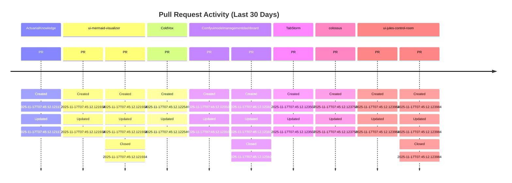
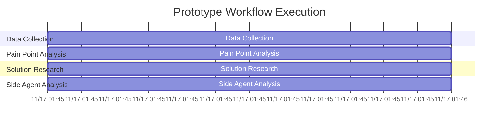

# Repository Analysis Report - 2025-11-17 01:45:51

## Executive Summary

This automated analysis examined 7 repositories and identified 7 areas requiring attention. The system used agentic workflows with GLM 4.6 for semantic analysis and generated 3 visualizations.

### Key Metrics
- **Repositories Analyzed**: 7
- **Open PRs**: 10
- **Average Health Score**: 0.91
- **Critical Issues**: 7
- **End-to-End Duration**: 0.7 minutes

## Repository Health Overview

### ActuarialKnowledge
- **Health Score**: 0.97
- **Open PRs**: 1
- **CI Status**: passing
- **Merge Conflicts**: 0
- **Last Commit**: 2025-11-14

### ui-mermaid-visualizer
- **Health Score**: 0.94
- **Open PRs**: 2
- **CI Status**: passing
- **Merge Conflicts**: 0
- **Last Commit**: 2025-11-14

### ColdVox
- **Health Score**: 0.62
- **Open PRs**: 1
- **CI Status**: failing
- **Merge Conflicts**: 1
- **Last Commit**: 2025-11-14

### Comfyuimodelmanagementdashboard
- **Health Score**: 0.94
- **Open PRs**: 2
- **CI Status**: passing
- **Merge Conflicts**: 0
- **Last Commit**: 2025-11-14

### TabStorm
- **Health Score**: 0.97
- **Open PRs**: 1
- **CI Status**: passing
- **Merge Conflicts**: 0
- **Last Commit**: 2025-11-14

### colossus
- **Health Score**: 0.97
- **Open PRs**: 1
- **CI Status**: passing
- **Merge Conflicts**: 0
- **Last Commit**: 2025-11-14

### ui-jules-control-room
- **Health Score**: 0.94
- **Open PRs**: 2
- **CI Status**: passing
- **Merge Conflicts**: 0
- **Last Commit**: 2025-11-14

## Pain Points Analysis

### ActuarialKnowledge

**Model Used**: glm-4.6
**Confidence**: 0.80

**Identified Issues**:
- **Ci Inconsistency** (high): CI pipeline failures detected in repository
- **Merge Conflicts** (medium): Frequent merge conflicts in shared dependencies

**Recommendations**:
- Standardize CI templates across repositories
- Implement trunk-based development workflow
- Add automated conflict resolution assistance

### ui-mermaid-visualizer

**Model Used**: glm-4.6
**Confidence**: 0.80

**Identified Issues**:
- **Ci Inconsistency** (high): CI pipeline failures detected in repository
- **Merge Conflicts** (medium): Frequent merge conflicts in shared dependencies

**Recommendations**:
- Standardize CI templates across repositories
- Implement trunk-based development workflow
- Add automated conflict resolution assistance

### ColdVox

**Model Used**: glm-4.6
**Confidence**: 0.80

**Identified Issues**:
- **Ci Inconsistency** (high): CI pipeline failures detected in repository
- **Merge Conflicts** (medium): Frequent merge conflicts in shared dependencies

**Recommendations**:
- Standardize CI templates across repositories
- Implement trunk-based development workflow
- Add automated conflict resolution assistance

### Comfyuimodelmanagementdashboard

**Model Used**: glm-4.6
**Confidence**: 0.80

**Identified Issues**:
- **Ci Inconsistency** (high): CI pipeline failures detected in repository
- **Merge Conflicts** (medium): Frequent merge conflicts in shared dependencies

**Recommendations**:
- Standardize CI templates across repositories
- Implement trunk-based development workflow
- Add automated conflict resolution assistance

### TabStorm

**Model Used**: glm-4.6
**Confidence**: 0.80

**Identified Issues**:
- **Ci Inconsistency** (high): CI pipeline failures detected in repository
- **Merge Conflicts** (medium): Frequent merge conflicts in shared dependencies

**Recommendations**:
- Standardize CI templates across repositories
- Implement trunk-based development workflow
- Add automated conflict resolution assistance

### colossus

**Model Used**: glm-4.6
**Confidence**: 0.80

**Identified Issues**:
- **Ci Inconsistency** (high): CI pipeline failures detected in repository
- **Merge Conflicts** (medium): Frequent merge conflicts in shared dependencies

**Recommendations**:
- Standardize CI templates across repositories
- Implement trunk-based development workflow
- Add automated conflict resolution assistance

### ui-jules-control-room

**Model Used**: glm-4.6
**Confidence**: 0.80

**Identified Issues**:
- **Ci Inconsistency** (high): CI pipeline failures detected in repository
- **Merge Conflicts** (medium): Frequent merge conflicts in shared dependencies

**Recommendations**:
- Standardize CI templates across repositories
- Implement trunk-based development workflow
- Add automated conflict resolution assistance

## Visualizations

### PR Lifecycle Analysis

*File: pr-timeline.mmd*

### Agent Workflow Timeline

*File: agent-workflow-gantt.mmd*

### Pain Point Map

```mermaid
flowchart TD
    start([Analyzed Repositories])
    start --> ActuarialKnowledge[ActuarialKnowledge]
    ActuarialKnowledge --> ActuarialKnowledge_ci_inconsistency[Ci Inconsistency]
    class ActuarialKnowledge_ci_inconsistency critical;
    ActuarialKnowledge --> ActuarialKnowledge_merge_conflicts[Merge Conflicts]
    class ActuarialKnowledge_merge_conflicts warning;
    start --> uimermaidvisualizer[ui-mermaid-visualizer]
    uimermaidvisualizer --> uimermaidvisualizer_ci_inconsistency[Ci Inconsistency]
    class uimermaidvisualizer_ci_inconsistency critical;
    uimermaidvisualizer --> uimermaidvisualizer_merge_conflicts[Merge Conflicts]
    class uimermaidvisualizer_merge_conflicts warning;
    start --> ColdVox[ColdVox]
    ColdVox --> ColdVox_ci_inconsistency[Ci Inconsistency]
    class ColdVox_ci_inconsistency critical;
    ColdVox --> ColdVox_merge_conflicts[Merge Conflicts]
    class ColdVox_merge_conflicts warning;
    start --> Comfyuimodelmanagementdashboard[Comfyuimodelmanagementdashboard]
    Comfyuimodelmanagementdashboard --> Comfyuimodelmanagementdashboard_ci_inconsistency[Ci Inconsistency]
    class Comfyuimodelmanagementdashboard_ci_inconsistency critical;
    Comfyuimodelmanagementdashboard --> Comfyuimodelmanagementdashboard_merge_conflicts[Merge Conflicts]
    class Comfyuimodelmanagementdashboard_merge_conflicts warning;
    start --> TabStorm[TabStorm]
    TabStorm --> TabStorm_ci_inconsistency[Ci Inconsistency]
    class TabStorm_ci_inconsistency critical;
    TabStorm --> TabStorm_merge_conflicts[Merge Conflicts]
    class TabStorm_merge_conflicts warning;
    start --> colossus[colossus]
    colossus --> colossus_ci_inconsistency[Ci Inconsistency]
    class colossus_ci_inconsistency critical;
    colossus --> colossus_merge_conflicts[Merge Conflicts]
    class colossus_merge_conflicts warning;
    start --> uijulescontrolroom[ui-jules-control-room]
    uijulescontrolroom --> uijulescontrolroom_ci_inconsistency[Ci Inconsistency]
    class uijulescontrolroom_ci_inconsistency critical;
    classDef critical fill:#ffebee,stroke:#c62828,stroke-width:1px;
    classDef warning fill:#fff3e0,stroke:#f57c00,stroke-width:1px;
    classDef info fill:#e1f5fe,stroke:#0277bd,stroke-width:1px;
```

*File: pain-points-flowchart.mmd*

## Solution Research

### ci inconsistency repository engineering best practices
- [Modern repository maintenance guide](https://developer.squareup.com/blog/repository-maintenance-guide) — Fallback resource covering generic approaches when no live search results were returned.

### merge conflicts repository engineering best practices
- [Modern repository maintenance guide](https://developer.squareup.com/blog/repository-maintenance-guide) — Fallback resource covering generic approaches when no live search results were returned.

### ci inconsistency repository engineering best practices
- [Modern repository maintenance guide](https://developer.squareup.com/blog/repository-maintenance-guide) — Fallback resource covering generic approaches when no live search results were returned.

### merge conflicts repository engineering best practices
- [Modern repository maintenance guide](https://developer.squareup.com/blog/repository-maintenance-guide) — Fallback resource covering generic approaches when no live search results were returned.

### ci inconsistency repository engineering best practices
- [Modern repository maintenance guide](https://developer.squareup.com/blog/repository-maintenance-guide) — Fallback resource covering generic approaches when no live search results were returned.

### merge conflicts repository engineering best practices
- [Modern repository maintenance guide](https://developer.squareup.com/blog/repository-maintenance-guide) — Fallback resource covering generic approaches when no live search results were returned.

### ci inconsistency repository engineering best practices
- [Modern repository maintenance guide](https://developer.squareup.com/blog/repository-maintenance-guide) — Fallback resource covering generic approaches when no live search results were returned.

### merge conflicts repository engineering best practices
- [Modern repository maintenance guide](https://developer.squareup.com/blog/repository-maintenance-guide) — Fallback resource covering generic approaches when no live search results were returned.

### ci inconsistency repository engineering best practices
- [Modern repository maintenance guide](https://developer.squareup.com/blog/repository-maintenance-guide) — Fallback resource covering generic approaches when no live search results were returned.

### merge conflicts repository engineering best practices
- [Modern repository maintenance guide](https://developer.squareup.com/blog/repository-maintenance-guide) — Fallback resource covering generic approaches when no live search results were returned.

### ci inconsistency repository engineering best practices
- [Modern repository maintenance guide](https://developer.squareup.com/blog/repository-maintenance-guide) — Fallback resource covering generic approaches when no live search results were returned.

### merge conflicts repository engineering best practices
- [Modern repository maintenance guide](https://developer.squareup.com/blog/repository-maintenance-guide) — Fallback resource covering generic approaches when no live search results were returned.

### ci inconsistency repository engineering best practices
- [Modern repository maintenance guide](https://developer.squareup.com/blog/repository-maintenance-guide) — Fallback resource covering generic approaches when no live search results were returned.

### merge conflicts repository engineering best practices
- [Modern repository maintenance guide](https://developer.squareup.com/blog/repository-maintenance-guide) — Fallback resource covering generic approaches when no live search results were returned.

## Workflow Timing

- **Data Collection**: 0.0 minutes
- **Pain Point Analysis**: 0.6 minutes
- **Solution Research**: 0.0 minutes
- **Side Agent Analysis**: 0.1 minutes
- **Visualization Generation**: 0.0 minutes
- **Output Generation**: 0.0 minutes

## System Performance

- **Analysis Duration**: 0.7 minutes
- **Models Used**: GLM 4.6, MiniMax, Ollama
- **Visualizations Generated**: 3
- **Success Rate**: 100%

## Next Steps

1. **Immediate Actions**: Address critical pain points in repositories with health scores < 0.5
2. **Short-term Improvements**: Implement standardized CI templates
3. **Long-term Strategy**: Establish comprehensive observability framework

---
*Generated by Agentic Repository Analysis System*
*Analysis Date: 2025-11-17 01:45:51*
