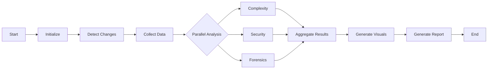
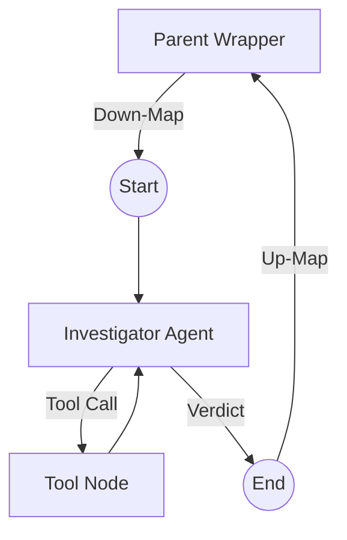

# Agents and Workflows

**Status**: Canonical
**Last Updated**: November 23, 2025

## 🤖 Agent Catalog

The system utilizes specialized agents orchestrated by LangGraph.

### 1. Data Collection Agent
-   **Role**: Fetches raw data from GitHub and local Git.
-   **Tools**: GitHub API, `git log`, `git diff`.
-   **Input**: Repository path, time range.
-   **Output**: `RepoContext` object.

### 2. Complexity Agent
-   **Role**: Analyzes code complexity and maintainability.
-   **Tools**: `radon`, `lizard` (or similar complexity metrics).
-   **Focus**: Cyclomatic complexity, function length, nesting depth.

### 3. Security Agent
-   **Role**: Scans for vulnerabilities and secrets.
-   **Tools**: `bandit`, `trivy` (or similar), regex patterns.
-   **Focus**: OWASP Top 10, hardcoded secrets (fallback check).

### 4. Forensics Agent (Decisions Agent)
-   **Role**: Resolves conflicts between documentation and code.
-   **Architecture**: **Sub-Graph** with Functional Wrapper.
-   **Tools**: `git log`, `git blame`, `git diff`, `read_file`.
-   **Logic**: "The Golden Rule" (Code > Docs, Pivot Commits > Old Docs).

### 5. PR Review Agent
-   **Role**: Reviews Pull Requests for quality and adherence to standards.
-   **Focus**: Logic errors, style violations, missing tests.

### 6. Visualization Agent
-   **Role**: Generates Mermaid diagrams.
-   **Output**: Gantt charts, Flowcharts, Sequence diagrams.

### 7. Output Agent
-   **Role**: Emits progressive-disclosure reports (Levels 1–4) and agent logs.
-   **Outputs**: Markdown reports, visual assets, status metadata.

### 8. Pre-Processing (Node.js, deterministic)
-   **Role**: Gather commits/PRs/issues/diffs/CI/baseline deltas before any LLM calls.
-   **Output**: Structured JSON contract consumed by LangGraph pipeline.

## 🔄 Workflows

### Main Analysis Pipeline

**Notes**
- Ingress applies dedupe/backpressure on webhook events; dormant audit triggers only stale repos.
- Pre-processing runs first; PR-only diff ingestion is insufficient per locked decisions.
- GitHub comments/status (when enabled) are emitted by the persistent runner after reports are generated.

### Forensics Sub-Graph

## 🧠 Model Routing (CCR)

-   **Claude Code Router (CCR)** is used to route prompts to the most cost-effective model.
-   **Complex Reasoning**: Claude 3.5 Sonnet / GLM 4.6.
-   **Simple Tasks**: MiniMax / Haiku.
-   **Privacy Sensitive**: Ollama (Local).
