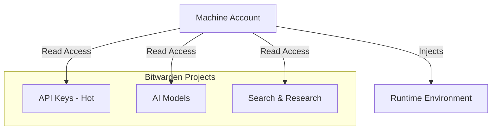

# Bitwarden Secrets Manager Integration

**Date**: November 17, 2025
**Status**: PROPOSED
**Version**: 1.0

---

## Overview

This document outlines the integration of Bitwarden Secrets Manager into the repo-analysis-system for secure, automated secrets management across local development, cron execution, and CI/CD pipelines.

## Current State

### Secrets Used
The system currently requires the following API credentials:

| Secret | Purpose | Current Storage |
|--------|---------|----------------|
| `GITHUB_TOKEN` | GitHub API access for repository data | Environment variable |
| `GITHUB_OWNER` | Default repository owner | Environment variable |
| `GLM_API_KEY` | GLM 4.6 AI model for analysis | Environment variable |
| `MINIMAX_API_KEY` | MiniMax AI model for lightweight tasks | Environment variable |
| `GOOGLE_SEARCH_KEY` | Google Custom Search API | Environment variable |
| `GOOGLE_CX` | Google Custom Search Engine ID | Environment variable |

### Current Configuration
Secrets are referenced in `config.yaml` using environment variable expansion:

```yaml
api_keys:
  github_token: "${GITHUB_TOKEN}"
  glm_api_key: "${GLM_API_KEY}"
  minimax_api_key: "${MINIMAX_API_KEY}"
  google_search_key: "${GOOGLE_SEARCH_KEY}"
```

### Problems with Current Approach
1. **Manual Management**: Each environment (local, cron, CI/CD) requires manual secret setup
2. **No Audit Trail**: No visibility into when/where secrets are accessed
3. **Rotation Complexity**: Updating secrets requires changing multiple locations
4. **Security Risk**: Secrets may persist in shell history, logs, or process lists
5. **No Centralization**: Secrets scattered across multiple systems

---

## Proposed Solution: Bitwarden Secrets Manager

### Strategy: Multi-Project Access
Due to Bitwarden organization limits on the number of allowed projects, we will **not** create a dedicated "Repo Analysis System" project. Instead, we will leverage the existing project structure and grant the machine account access to all relevant projects.

**Rationale**:
- **Constraint**: Limited number of Bitwarden projects allowed per organization.
- **Solution**: The `bws` CLI natively supports accessing secrets from multiple projects simultaneously if the machine account has permissions for them.
- **Benefit**: Avoids restructuring existing secrets or hitting plan limits while maintaining secure, centralized access.

### Architecture



### Key Benefits
1. **Ephemeral Secrets**: Secrets injected at runtime, never written to disk
2. **Centralized Management**: Single source of truth for all environments
3. **Audit Trail**: Track all secret access via machine accounts
4. **Easy Rotation**: Update once in Bitwarden, all environments get new secrets
5. **GitHub Actions Native**: Official integration with automatic masking
6. **Multi-Environment**: Same approach works locally, in cron, and in CI/CD

---

## Implementation Plan

### Phase 1: Bitwarden Setup (Using Existing Projects)

#### Step 1.1: Verify Existing Projects
Ensure your machine account has access to your existing projects:
- **API Keys - Hot** (General API keys)
- **AI Models** (LLM credentials)
- **Search & Research** (Search provider keys)

#### Step 1.2: Add Missing Secrets
Add any missing secrets to one of your existing projects (e.g., "API Keys - Hot").
**Critical Missing Secret**:
- `GITHUB_TOKEN` (Required for repository access)

#### Step 1.3: Configure Machine Account
1. Go to **Secrets Manager** → **Machine Accounts**
2. Select your machine account (e.g., "repo-analysis-automation")
3. Grant **Read** access to ALL three projects listed above.
4. Set the access token in your environment:

```powershell
$env:BWS_ACCESS_TOKEN = "<your_token_here>"
```

#### Step 1.4: Verify Access
Run the following to confirm you can see secrets from multiple projects:
```powershell
bws run -- env
```

#### Step 1.5: Secure Token Storage (Windows)
```powershell
# Create secure directory
New-Item -ItemType Directory -Force -Path "$env:USERPROFILE\.bws"

# Store token securely
Set-Content -Path "$env:USERPROFILE\.bws\repo-analysis-token.txt" -Value $env:BWS_ACCESS_TOKEN

# Make hidden
(Get-Item "$env:USERPROFILE\.bws\repo-analysis-token.txt").Attributes += 'Hidden'

# Add to PowerShell profile for automatic loading
Add-Content -Path $PROFILE -Value @"

# Bitwarden Secrets Manager token for repo-analysis-system
`$env:BWS_ACCESS_TOKEN = Get-Content -Path "`$env:USERPROFILE\.bws\repo-analysis-token.txt" -ErrorAction SilentlyContinue
"@
```

---

### Phase 2: Local Development Integration

#### Update Documentation
Update README.md to include Bitwarden setup:

```markdown
### Prerequisites

1. Install Bitwarden Secrets Manager CLI (`bws`)
   - Windows: Download from https://github.com/bitwarden/sdk/releases
   - Add to PATH

2. Configure Bitwarden access token
   ```powershell
   # Store in profile (Windows PowerShell)
   $env:BWS_ACCESS_TOKEN = "<your_token>"
   ```

### Running Locally

```bash
# With Bitwarden (recommended)
bws run -- python agentic_prototype.py

# Or using the shell script wrapper
bws run -- ./run_prototype.sh

# Secrets are automatically injected at runtime
```
```

#### Create Wrapper Script (Optional)
Create `run_with_secrets.sh`:

```bash
#!/bin/bash
# Wrapper script to run prototype with Bitwarden secrets

# Check bws is installed
if ! command -v bws &> /dev/null; then
    echo "ERROR: bws CLI not found. Install from https://github.com/bitwarden/sdk/releases"
    exit 1
fi

# Check token is set
if [ -z "$BWS_ACCESS_TOKEN" ]; then
    echo "ERROR: BWS_ACCESS_TOKEN not set"
    echo "Export it or add to your shell profile"
    exit 1
fi

# Run with secrets injected
echo "Fetching secrets from Bitwarden..."
bws run -- python agentic_prototype.py "$@"
```

---

### Phase 3: Cron/Systemd Integration

#### Option A: Cron with bws wrapper
Update crontab to use `bws run`:

```bash
# Edit crontab
crontab -e

# Add (recurring run with Bitwarden secrets)
<cron cadence> export BWS_ACCESS_TOKEN=$(cat ~/.bws/repo-analysis-token.txt) && cd /path/to/repo-analysis-system && /usr/local/bin/bws run -- python agentic_prototype.py >> logs/cron.log 2>&1
```

#### Option B: Systemd Service (Recommended for Linux)
Create `/etc/systemd/system/repo-analysis.service`:

```ini
[Unit]
Description=Repository Analysis System
After=network.target

[Service]
Type=oneshot
User=<your_user>
WorkingDirectory=/path/to/repo-analysis-system
Environment="BWS_ACCESS_TOKEN=<token>"
ExecStart=/usr/local/bin/bws run -- /usr/bin/python3 agentic_prototype.py
StandardOutput=append:/path/to/repo-analysis-system/logs/systemd.log
StandardError=append:/path/to/repo-analysis-system/logs/systemd-error.log

[Install]
WantedBy=multi-user.target
```

Create `/etc/systemd/system/repo-analysis.timer`:

```ini
[Unit]
Description=Run Repository Analysis on a recurring cadence
Requires=repo-analysis.service

[Timer]
OnBootSec=15min
OnUnitActiveSec=<cadence>
Unit=repo-analysis.service

[Install]
WantedBy=timers.target
```

Enable and start:

```bash
sudo systemctl daemon-reload
sudo systemctl enable repo-analysis.timer
sudo systemctl start repo-analysis.timer

# Check status
sudo systemctl status repo-analysis.timer
sudo systemctl list-timers
```

#### Option C: Windows Scheduled Task
Create `scheduled-task.ps1`:

```powershell
# Load token
$env:BWS_ACCESS_TOKEN = Get-Content -Path "$env:USERPROFILE\.bws\repo-analysis-token.txt"

# Run with Bitwarden secrets
Set-Location "E:\_projectsGithub\repo-analysis-system"
& "C:\Users\pmacl\AppData\Local\Programs\Bitwarden\bws.exe" run -- python agentic_prototype.py
```

Create scheduled task:

```powershell
$action = New-ScheduledTaskAction -Execute "powershell.exe" -Argument "-File E:\_projectsGithub\repo-analysis-system\scheduled-task.ps1"
$trigger = New-ScheduledTaskTrigger -Once -At (Get-Date) -RepetitionInterval (New-TimeSpan -Hours 6) -RepetitionDuration ([System.TimeSpan]::MaxValue)
$settings = New-ScheduledTaskSettingsSet -AllowStartIfOnBatteries -DontStopIfGoingOnBatteries -StartWhenAvailable
Register-ScheduledTask -TaskName "RepositoryAnalysis" -Action $action -Trigger $trigger -Settings $settings -Description "Automated repository analysis with Bitwarden secrets"
```

---

### Phase 4: GitHub Actions Integration

#### Step 4.1: Add Bitwarden Token to GitHub Secrets
1. Navigate to repository **Settings** → **Secrets and variables** → **Actions**
2. Click **New repository secret**
3. Name: `BWS_ACCESS_TOKEN`
4. Value: `<your_bitwarden_machine_account_token>`
5. Click **Add secret**

#### Step 4.2: Get Secret IDs
Run locally to get secret IDs for GitHub Actions:

```powershell
# Get all secrets with IDs
bws secret list --output json | ConvertFrom-Json | Select-Object id, key | Format-Table

# Or generate YAML snippet
$secrets = bws secret list --output json | ConvertFrom-Json
Write-Host "secrets: |"
foreach ($secret in $secrets) {
    Write-Host "  $($secret.id) > $($secret.key)"
}
```

#### Step 4.3: Create GitHub Actions Workflow
Create `.github/workflows/analyze.yml`:

```yaml
name: Automated Repository Analysis

on:
  schedule:
    - cron: '0 */6 * * *'  # Every 6 hours
  workflow_dispatch:  # Allow manual trigger
  push:
    branches: [ main ]
  pull_request:
    branches: [ main ]

jobs:
  analyze:
    runs-on: ubuntu-latest

    steps:
      - name: Checkout repository
        uses: actions/checkout@v4

      - name: Set up Python
        uses: python/setup-python@v5
        with:
          python-version: '3.11'
          cache: 'pip'

      - name: Install dependencies
        run: |
          pip install -r requirements.txt

      - name: Load secrets from Bitwarden
        uses: bitwarden/sm-action@v1
        with:
          access_token: ${{ secrets.BWS_ACCESS_TOKEN }}
          secrets: |
            <SECRET_ID_GITHUB_TOKEN> > GITHUB_TOKEN
            <SECRET_ID_GITHUB_OWNER> > GITHUB_OWNER
            <SECRET_ID_GLM_API_KEY> > GLM_API_KEY
            <SECRET_ID_MINIMAX_API_KEY> > MINIMAX_API_KEY
            <SECRET_ID_GOOGLE_SEARCH_KEY> > GOOGLE_SEARCH_KEY
            <SECRET_ID_GOOGLE_CX> > GOOGLE_CX

      - name: Run repository analysis
        run: |
          python agentic_prototype.py
        env:
          GITHUB_TOKEN: ${{ env.GITHUB_TOKEN }}
          GITHUB_OWNER: ${{ env.GITHUB_OWNER }}
          GLM_API_KEY: ${{ env.GLM_API_KEY }}
          MINIMAX_API_KEY: ${{ env.MINIMAX_API_KEY }}
          GOOGLE_SEARCH_KEY: ${{ env.GOOGLE_SEARCH_KEY }}
          GOOGLE_CX: ${{ env.GOOGLE_CX }}

      - name: Upload analysis results
        uses: actions/upload-artifact@v4
        if: always()
        with:
          name: analysis-results
          path: |
            logs/
            review_logging/
          retention-days: 30

      - name: Commit visualizations (if changed)
        if: github.event_name == 'schedule' || github.event_name == 'workflow_dispatch'
        run: |
          git config --local user.email "github-actions[bot]@users.noreply.github.com"
          git config --local user.name "github-actions[bot]"
          git add review_logging/visualizations/
          git diff --staged --quiet || git commit -m "Update visualizations [automated]"
          git push
```

**Replace** `<SECRET_ID_*>` placeholders with actual secret IDs from Step 4.2.

---

### Phase 5: Code Updates (Optional - No Changes Required)

**IMPORTANT**: The current code already works perfectly with Bitwarden!

The `agentic_prototype.py` uses `os.path.expandvars()` to read environment variables:

```python
def _expand_env(value: Any) -> Any:
    """Resolve environment variables in configuration values."""
    if isinstance(value, str):
        return os.path.expandvars(value)
    # ...
```

When you run with `bws run -- python agentic_prototype.py`:
1. `bws` fetches secrets from Bitwarden
2. Injects them as environment variables (`GITHUB_TOKEN`, `GLM_API_KEY`, etc.)
3. Python script reads them via `${GITHUB_TOKEN}` expansion
4. Everything works identically to the current approach

**No code changes needed!** The integration is transparent.

---

## Migration Checklist

### Pre-Migration
- [ ] Install `bws` CLI on all systems (local, cron server)
- [ ] Create Bitwarden Secrets Manager project
- [ ] Create machine account and generate token
- [ ] Migrate all secrets to Bitwarden project
- [ ] Verify secrets are accessible via `bws secret list`
- [ ] Test locally with `bws run -- python agentic_prototype.py`

### Local Development
- [ ] Store `BWS_ACCESS_TOKEN` in secure location
- [ ] Add token to shell profile for automatic loading
- [ ] Update README with Bitwarden setup instructions
- [ ] Verify analysis runs successfully with injected secrets

### Cron/Scheduled Execution
- [ ] Update cron job to use `bws run` wrapper
- [ ] Or create systemd service/timer with bws integration
- [ ] Or create Windows scheduled task with PowerShell wrapper
- [ ] Test scheduled execution
- [ ] Monitor logs for secret injection success

### GitHub Actions
- [ ] Add `BWS_ACCESS_TOKEN` to GitHub repository secrets
- [ ] Get secret IDs from Bitwarden
- [ ] Create `.github/workflows/analyze.yml` with sm-action
- [ ] Replace secret ID placeholders with actual IDs
- [ ] Test workflow manually via workflow_dispatch
- [ ] Verify secrets are properly injected and masked in logs

### Cleanup
- [ ] Remove old environment variables from local shell profiles
- [ ] Update documentation to reflect Bitwarden-first approach
- [ ] Remove any `.env` files (if they exist)
- [ ] Add `.env*` to `.gitignore` (preventive)
- [ ] Document token rotation procedure

---

## Security Considerations

### Machine Account Token Security
1. **Never commit** the `BWS_ACCESS_TOKEN` to git
2. **Store securely** in operating system keychain or hidden files
3. **Rotate regularly** (at least every 90 days)
4. **Use separate tokens** for different environments (local vs CI/CD) if needed
5. **Revoke immediately** if compromised

### Audit Trail
Bitwarden Secrets Manager provides:
- Access logs for all machine account operations
- Timestamp tracking for secret retrieval
- User attribution for secret modifications

### Secret Rotation
To rotate a secret:
1. Update value in Bitwarden: `bws secret edit <secret-id> --value "new_value"`
2. All systems automatically get new value on next execution
3. No code changes required
4. No environment variable updates needed

### Least Privilege
- Machine accounts only have access to "Repo Analysis System" project
- Read-only access is sufficient for runtime (change to Read if possible)
- Separate machine accounts for different use cases (local dev vs production)

---

## Troubleshooting

### Issue: `bws: command not found`
**Solution**: Install bws CLI from https://github.com/bitwarden/sdk/releases and add to PATH

### Issue: "Unauthorized" error from bws
**Solution**: Check `BWS_ACCESS_TOKEN` is set correctly:
```bash
echo $BWS_ACCESS_TOKEN  # Should not be empty
bws secret list  # Should return secrets without error
```

### Issue: Secrets not injecting into Python
**Solution**: Verify `bws run` is actually wrapping the command:
```bash
bws run -- env | grep GITHUB_TOKEN  # Should show the token
```

### Issue: GitHub Actions secrets not masked
**Solution**: Use the official `bitwarden/sm-action@v1` which auto-masks secrets in logs

### Issue: Cron job not finding bws
**Solution**: Use full path to bws in crontab:
```bash
0 */6 * * * /usr/local/bin/bws run -- /usr/bin/python3 /full/path/to/agentic_prototype.py
```

---

## Cost Analysis

### Bitwarden Secrets Manager Free Tier
- **2 users**: Sufficient for personal/small team use
- **3 machine accounts**: Sufficient for local + cron + CI/CD
- **Unlimited secrets**: All 6+ secrets easily accommodated
- **Unlimited projects**: Can separate dev/staging/prod if needed

### Paid Tier ($6/month if needed)
- **10 users**: Team expansion
- **20 machine accounts**: Multiple environments/systems
- **Advanced audit logs**: Enhanced security
- **Support**: Professional assistance

**Recommendation**: Free tier is sufficient for current needs

---

## Next Steps

1. **Immediate**: Complete Phase 1 (Bitwarden Setup) manually in web UI
2. **Short-term**: Test local development with `bws run` (Phase 2)
3. **Medium-term**: Update cron/scheduled tasks (Phase 3)
4. **Long-term**: Implement GitHub Actions integration (Phase 4)

---

## References

- **Bitwarden Secrets Manager Docs**: https://bitwarden.com/help/secrets-manager-cli/
- **GitHub Actions Integration**: https://bitwarden.com/help/github-actions-integration/
- **sm-action Documentation**: https://github.com/marketplace/actions/bitwarden-secrets-manager
- **Obsidian Vault Reference**: `E:\Obsidian Vault\LLM\Bitwarden_GitHub_Actions_Integration.md`
- **Obsidian Vault Playbook**: `E:\Obsidian Vault\Quick Reference\bitwarden-playbook.md`

---

*This integration provides enterprise-grade secrets management with zero code changes, automatic rotation, audit trails, and consistent behavior across all execution environments.*
