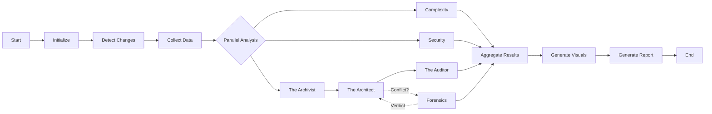
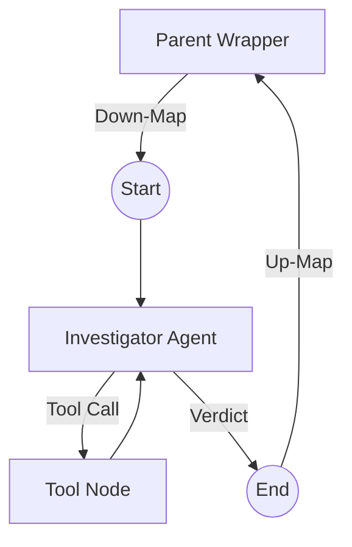

# Agents and Workflows

**Status**: Canonical
**Last Updated**: November 23, 2025

## 🤖 Agent Catalog

The system utilizes specialized agents orchestrated by LangGraph. Each agent is designed with a specific "Agency" profile, equipped with a distinct toolbox and prompt strategy.

### 1. The Archivist (DocCatalog Agent)
-   **Role**: Explorer & Librarian. Discovers every source of "Intent" in the repo.
-   **Goal**: Identify all files that describe how this system *should* work (READMEs, architecture docs, config files).
-   **Toolbox**:
    -   `list_directory(path)`: Discover file structure.
    -   `read_file(path)`: Read content of docs and configs.
    -   `find_files(pattern)`: Locate specific file types (e.g., `*.md`, `Dockerfile`).
-   **Prompt Strategy**: "Identify all files that describe how this system *should* work. Rank them by apparent authority."

### 2. The Architect (PillarExtraction Agent)
-   **Role**: Synthesizer & Planner. Synthesizes a coherent "Blueprint" from fragmented intent sources.
-   **Goal**: Extract the 3-5 core "Architectural Pillars" (non-negotiable design decisions).
-   **Toolbox**:
    -   `read_file(path)`: Deep reading of architectural docs.
    -   `consult_expert_model(query, context)`: Offload complex reasoning (e.g., "Analyze this 500-line config and extract the implicit architecture").
-   **Prompt Strategy**: "Ignore the code. Read these documents and tell me the core 'Architectural Pillars'. What are the non-negotiable design decisions?"

### 3. The Auditor (ImplementationValidator Agent)
-   **Role**: Investigator & Verifier. Compares the Blueprint against Reality.
-   **Goal**: Perform a Gap Analysis between the "Pillars" and the actual Source Code.
-   **Toolbox**:
    -   `grep_search(pattern)`: Find specific imports, class names, or comments.
    -   `file_search(glob)`: Verify existence of expected files.
    -   `read_file(path)`: Inspect implementation details.
    -   `check_import(module_name)`: Verify if a library is actually used.
-   **Prompt Strategy**: "Here is the Blueprint. Here is the Code. For each pillar, does the code implement it? Is it partial? Is it completely missing?"

### 4. The Decisions Agent (Forensics)
-   **Role**: Software Historian & Conflict Resolver.
-   **Trigger**: Activates when The Architect finds conflicting information (e.g., "README says SQLite, but `docker-compose` says Postgres").
-   **Goal**: Determine the "True Intent" using forensic history.
-   **Toolbox**:
    -   `git_log(file_path, limit)`: See *when* a file changed.
    -   `git_blame(file_path)`: See *who* changed specific lines.
    -   `git_diff(commit_a, commit_b)`: See *what* exactly changed in a pivot.
    -   `consult_expert_model`: Ask a "Smarter Brain" to interpret a messy diff.
-   **Logic Flow**:
    1.  **Hypothesis**: "README says X, Code says Y."
    2.  **Investigation**: Check git history for "Refactor" or "Pivot" commits.
    3.  **Verdict**: "The README is rotting. The project uses PostgreSQL."

### 5. Complexity Agent
-   **Role**: Code Quality Analyst.
-   **Tools**: `radon`, `lizard`.
-   **Focus**: Cyclomatic complexity, function length, nesting depth.

### 6. Security Agent
-   **Role**: Vulnerability Scanner.
-   **Tools**: `bandit`, `trivy` (or similar), regex patterns.
-   **Focus**: OWASP Top 10, hardcoded secrets (fallback check).

### 7. Visualization Agent
-   **Role**: Diagram Generator.
-   **Output**: Mermaid diagrams (Gantt charts, Flowcharts, Sequence diagrams) based on analysis results.

### 8. Output Agent
-   **Role**: Reporter.
-   **Responsibility**: Emits progressive-disclosure reports (Levels 1–4) and agent logs.

---

## 🔄 Workflows

### Main Analysis Pipeline

### Forensics Sub-Graph (Pattern B)

The Forensics Agent is implemented as a sub-graph to allow for multi-step reasoning loops without blocking the main graph.

## 🧠 Model Routing (CCR)

The system uses **Claude Code Router (CCR)** to optimize cost and performance.

-   **Claude 3.5 Sonnet / GLM 4.6**: Used for **Complex Reasoning** (Architect, Forensics).
-   **Haiku / MiniMax**: Used for **Simple Tasks** (Archivist, basic summarization).
-   **Ollama (Local)**: Used for **Privacy Sensitive** scans or when offline.

## 🛠️ Pre-Processing (Node.js)

Before the LangGraph pipeline starts, a Node.js layer performs deterministic data gathering:
-   **Git Operations**: Clone, fetch, diff, log.
-   **GitHub API**: Fetch PRs, Issues, CI status.
-   **Repository Charter Comparison**: Diff vs. locked charter/intent record.
-   **Output**: A structured JSON contract fed into the LangGraph state.

## 🧩 Developer Patterns (LangGraph v1.0)
- **Reducers (TypedDict + Annotated)**: Reducers follow `CurrentValue, UpdateValue -> NewValue`. Return *deltas* only; avoid re-emitting full lists (prevents exponential duplication).
- **add_messages semantics**: Appends by default; respect message IDs if present. Do not return prior messages unless intended.
- **ToolNode scatter/gather**: Tools run in parallel; state updates at the barrier. Emit ToolMessage errors as needed to preserve causality.
- **return_direct tools**: If a tool returns directly, route its edge explicitly to END or the next consumer.
- **Runtime/context**: Prefer passing `runtime` with typed context into nodes vs. global config. Example signature: `def node_fn(state: State, runtime: Runtime): ...`.
- **Private/ephemeral state**: Keep scratch data out of persisted state/checkpoints; scope it to subgraphs where possible.
