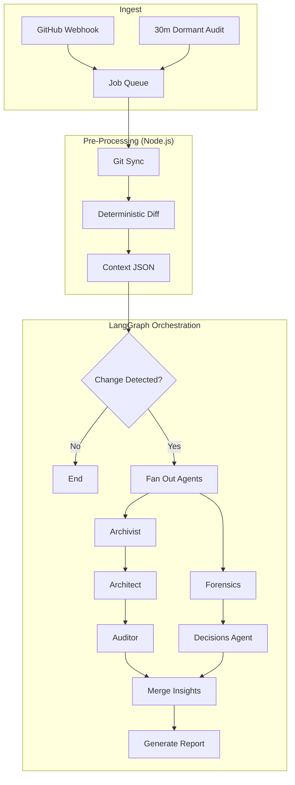

# System Architecture

**Status**: Canonical
**Last Updated**: November 23, 2025

## 🏗️ High-Level Overview

The **Repository Analysis System** is a hybrid **Python + Node.js** application orchestrated by **LangGraph**, designed for event-driven, parallel execution across multi-repository portfolios. It represents a "Big Bang" adoption of graph-based orchestration, moving away from sequential scripts to a stateful, resilient architecture.

### Core Philosophy: LLM-First Reasoning
Unlike traditional linters that check syntax, this system checks **meaning**. It uses LLMs to synthesize a "Mental Model" (Blueprint) of the system and audits the codebase against that plan.

-   **Don't** grep for "PostgreSQL".
-   **Do** ask the LLM: "Based on the history and config, what is the intended storage layer?"

#### The "Golden Rule" of Truth
When conflicts arise (e.g., README says one thing, Code says another), the system applies this hierarchy:
1.  **`/docs/` > `README.md`**: Detailed docs usually outweigh the README (which rots).
2.  **Pivot > History**: A recent "Refactor" or "Pivot" commit overrides *all* older documentation.
3.  **Code > Comments**: Working code is the ultimate reality.

---

## 🧩 System Components

### 1. Ingest Layer (Event-Driven)
The system is primarily reactive, triggered by GitHub events, but maintains a heartbeat for dormant repositories.

-   **Webhooks**: A GitHub App forwards events (Push, PR, Issue) to the runner.
-   **Dormant Audit (Cron)**: A 30-minute job scans for repositories whose Repository Charter snapshot is stale (>X hours) or missed webhooks.
-   **Queue**: Redis-backed job queue to handle burst events and apply backpressure.

### 2. Pre-Processing (Node.js)
**Role**: Deterministic data gathering *before* AI invocation.
**Rationale**: "Some stuff is trivial to pre-process, some requires AI."

-   **Responsibilities**:
    -   Git operations (clone, fetch, diff, log).
    -   GitHub API fetching (PRs, Issues, CI status).
    -   Charter comparison (diff vs. locked Repository Charter).
-   **Output**: Structured JSON fed into the LangGraph state.

### 3. Orchestration (LangGraph)
**Pattern**: Fan-out/Fan-in for multi-repo analysis.

-   **State Management**: `StateGraph` with `PostgresSaver` for persistence.
-   **Concurrency**: Controlled by `orchestration.langgraph.max_concurrent_runs`.
-   **Sub-Graphs**: Complex agents are encapsulated as sub-graphs.

### 4. The Agent Layer (The "Agency")
Agents are not just prompts; they are **Tool Users** with specific roles.

#### A. The Archivist (DocCatalog Agent)
-   **Goal**: Discover every source of "Intent" in the repo.
-   **Toolbox**: `list_directory`, `read_file`, `find_files`.
-   **Output**: A structured list of "Intent Sources" ranked by authority.

#### B. The Architect (PillarExtraction Agent)
-   **Goal**: Synthesize a coherent "Blueprint" from fragmented intent sources.
-   **Toolbox**: `read_file`, `consult_expert_model`.
-   **Output**: `architectural_pillars.md` (e.g., "Pillar 1: Event-Driven Architecture").

#### C. The Auditor (ImplementationValidator Agent)
-   **Goal**: Compare the Blueprint against Reality.
-   **Toolbox**: `grep_search`, `file_search`, `check_import`.
-   **Output**: `implementation_state.md` (Gap Analysis).

#### D. The Decisions Agent (Forensics)
-   **Goal**: The "Software Historian" that resolves conflicts.
-   **Workflow**:
    1.  **Hypothesis**: "README says X, Code says Y."
    2.  **Investigation**: `git_log`, `git_blame`, `git_diff`.
    3.  **Verdict**: "The README is rotting. The project uses PostgreSQL."

### 5. Storage Layer
-   **PostgreSQL**: The primary source of truth.
    -   Stores: Repository Charters/intent records, Analysis Runs, Metrics, Graph State (Checkpoints).
    -   Schema: Optimized for concurrent writes and JSON-structured data.
-   **Checkpointer**:
    -   Use a Postgres-backed checkpointer (e.g., PostgresSaver) for LangGraph state.
    -   Keep checkpoints lean; avoid large blobs/transient data.
    -   Support resume/time-travel when rerunning jobs; correlate job IDs to checkpoints.
-   **Bitwarden Secrets Manager**:
    -   Injected at runtime via `bws run` / `bitwarden/sm-action@v1`.
    -   No secrets stored in `.env` or code.

---

## 📊 Architecture Diagrams

### Multi-Repo Agent Manager
```
┌─────────────────────────────────────────────────────────────┐
│                    REPO AGENT MANAGER                       │
│                   (Main Orchestrator)                       │
└─────────────────┬───────────────────────────────────────────┘
                  │
    ┌─────────────┼─────────────┬──────────────┬──────────────┐
    │             │             │              │              │
┌───▼────┐  ┌────▼─────┐  ┌───▼──────┐  ┌───▼──────┐  ┌────▼─────┐
│ GitHub │  │   Repo   │  │  Agent   │  │ Report   │  │Scheduler │
│ Sync   │  │ Monitor  │  │ Spawner  │  │Generator │  │ Service  │
└───┬────┘  └────┬─────┘  └───┬──────┘  └───┬──────┘  └────┬─────┘
    │            │             │              │              │
    ▼            ▼             ▼              ▼              ▼
┌────────────────────────────────────────────────────────────────┐
│              PERSISTENT STATE (PostgreSQL)                     │
│  - repos (synced)                                              │
│  - goals (5 pillars)                                           │
│  - reports (historical)                                        │
└────────────────────────────────────────────────────────────────┘
```

### Execution Flow


---

## 📜 Key Architectural Decisions

### Decision 1: Hybrid Language Stack
**Decision**: Python Primary + Node.js for Pre-processing.
**Rationale**: Python is superior for AI/LangGraph; Node.js is superior for fast, I/O-bound Git operations and GitHub API interactions.

### Decision 2: "Big Bang" LangGraph
**Decision**: Adopt LangGraph immediately rather than phasing it in.
**Rationale**: Avoids building throwaway orchestration code. Repositories are independent, making them ideal for LangGraph's fan-out patterns.

### Decision 3: Event-Driven + Audit
**Decision**: Webhooks for immediate response; 30m Cron for safety net.
**Rationale**: Zero cost when inactive, but prevents "missed events" from causing permanent drift.

### Decision 4: PostgreSQL over SQLite
**Decision**: PostgreSQL is the required backend.
**Rationale**: SQLite cannot handle the concurrent writes required by parallel agents running across multiple repositories.

### Decision 5: Progressive Disclosure
**Decision**: Reports are generated in layers (Summary -> Visuals -> Detailed -> Raw).
**Rationale**: Different stakeholders need different levels of detail. The system preserves all raw artifacts for debugging.
