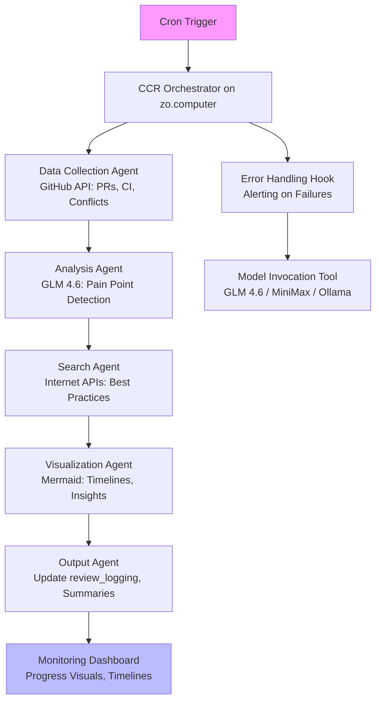

# Automated Cron Analysis System Design

## System Overview

The Automated Cron Analysis System is a periodically triggered workflow designed to continuously monitor and analyze the health of repositories in the workspace. Running remotely on zo.computer on a cron schedule, it scans for pull request (PR) status, CI/CD pipeline health, and merge conflicts. It leverages AI models for in-depth analysis, performs internet searches for best practices and solutions to identified pain points, and generates concise reports with actionable proposals. The system addresses key pain points from prior reviews, such as CI/CD inconsistencies, merge conflicts, and logging gaps, by automating detection, research, and remediation suggestions.

Core goals:
- Proactive identification of issues like stalled PRs, failing CI jobs, and conflict-prone branches.
- Integration of agentic workflows via Claude Code Router (CCR) for orchestrated analysis.
- Generation of lightweight outputs: updated logs in `review_logging`, Mermaid diagrams for timelines and pain points, and key insight summaries with drill-down prompts.
- Cost-aware operation with privacy-focused self-hosted models where possible.

This system builds on the existing `repo-analysis-system` by populating placeholders in `initial-pr-review-analysis.md` and extending reviews like `architectural-pain-points-review.md` and `logging-observability-review.md` with real-time data.

## Architecture Diagram (Mermaid)

This diagram illustrates the high-level flow: from scheduling to orchestrated agent execution, with hooks for errors and model calls, culminating in monitored outputs.

## Components

1. **Cron Scheduler**: Configured on zo.computer to trigger the main script. Uses platform-native cron or serverless timers for reliability.

2. **CCR Orchestrator**: Central router using Claude Code Router to chain agents. Defines workflows as prompt-based sequences, invoking tools for model calls (e.g., GLM 4.6 via API, MiniMax for quick tasks, Ollama for self-hosted privacy-sensitive analysis).

3. **Data Collection Agent**:
   - Fetches PR status (open/merged/stalled), CI health (pass/fail rates), and merge conflicts via GitHub API.
   - Scans workspace repos (e.g., ActuarialKnowledge, ui-mermaid-visualizer) for patterns like ad-hoc branching or missing pipelines.
   - Handles authentication via GitHub token stored in environment variables.

4. **Analysis Agent**:
   - Primary: GLM 4.6 for semantic analysis of collected data against pain points (e.g., CI inconsistencies from `architectural-pain-points-review.md`, logging gaps from `logging-observability-review.md`).
   - Lightweight: MiniMax Free for initial filtering (e.g., conflict detection).
   - Self-hosted: Ollama for local model runs on sensitive data, ensuring privacy.

5. **Search Agent**:
   - Performs targeted internet searches using curl with Google Custom Search API or GitHub API for solutions (e.g., "best Rust CI fixes for dependencies").
   - Integrates results into analysis, prioritizing open-source best practices.

6. **Visualization Agent**:
   - Generates Mermaid diagrams for PR timelines, pain point heatmaps, and agent workflows.
   - Outputs concise summaries (e.g., "3 stalled PRs in UI repos; recommend trunk-based dev") with prompts for deeper dives.

7. **Output Agent**:
   - Updates `review_logging` with new Markdown files (e.g., `cron-analysis-YYYY-MM-DD.md`).
   - Commits changes to `repo-analysis-system` via Git, with summaries avoiding verbose reports.

8. **Error Handling and Monitoring**:
   - Hooks in CCR for retries, logging failures to a dedicated channel.
   - Progress tracking via Mermaid Gantt charts showing agent execution times, models used, and overall timeline.

## Workflow Sequence

1. **Trigger**: Cron job invokes the CCR orchestrator script on zo.computer.
2. **Data Collection**: Agent queries GitHub API for repo states (PRs, CI runs, conflicts). Filters to active repos in workspace (e.g., based on last commit <7 days).
3. **Analysis**: Feed data to GLM 4.6 for pain point scoring (e.g., conflict rate >10% flags high risk). Use MiniMax for quick triage if GLM quota low.
4. **Research**: For flagged issues, search APIs (e.g., curl "https://api.github.com/search/code?q=CI+rust+dependencies"). Parse results for proposals.
5. **Synthesis**: Chain to visualization agent: Generate Mermaid for insights (e.g., sequence diagram of PR bottlenecks).
6. **Output Generation**: Create summary Markdown with key insights, proposals, and diagrams. Append to `review_logging`.
7. **Commit and Monitor**: Git push updates; generate progress visual (e.g., Sankey diagram of work distribution). Alert on anomalies (e.g., via email/Slack if failure rate >20%).
8. **Cleanup**: Log full run metrics; self-hosted models purge temp data for privacy.

Error paths: If API rate-limited, fallback to cached data; if model fails, retry with MiniMax.

## Implementation Steps

1. **Environment Setup on zo.computer**:
   - Create a new project or use existing serverless functions.
   - Install dependencies: Python (for scripting), requests (API calls), mermaid-py (diagrams), ollama (self-hosted).
   - Set environment variables: `GITHUB_TOKEN`, `GOOGLE_API_KEY`, `GLM_API_KEY`, `MINIMAX_API_KEY`, `OLLAMA_URL`.

2. **Develop Core Script**:
   - Main entry: `cron_analysis.py` using CCR prompts to define agent chains.
   - Implement agents as functions: e.g., `collect_data(workspace_repos)`, `analyze_with_glm(data)`.
   - Integrate tools: GitHub API via PyGitHub, searches via google-search-results lib.

3. **CCR Configuration**:
   - Define workflow YAML/JSON: sequences like "collect -> analyze -> search -> visualize".
   - Hooks: Error handler prompts GLM for diagnosis; model selector based on task (privacy-sensitive -> Ollama).

4. **Output Handling**:
   - Clone `repo-analysis-system` locally on zo.computer, update files, commit/push.
   - Use GitHub API for automated PR if changes significant.

5. **Scheduling**:
   - Deploy as a cron job on zo.computer.
   - Or use a serverless timer trigger.

6. **Testing**:
   - Local dry-run with mock data.
   - Deploy to zo.computer staging; monitor first runs.

7. **Monitoring Setup**:
   - Integrate simple alerting (e.g., via webhook to Discord).
   - Track runs with a log file visualized in Mermaid.

## Security Considerations
- API Keys: Stored as encrypted env vars on zo.computer; rotate quarterly.
- Data Privacy: Use Ollama for sensitive repo scans; anonymize logs (no code snippets in summaries).
- Access Control: GitHub token scoped to read-only for analysis repos; no write access to production.
- Network: HTTPS only; rate-limit searches to avoid abuse.
- Auditing: Log all agent invocations; alert on anomalous API usage.
- Compliance: Adhere to GitHub ToS; no storage of external search results beyond session.

## Integration with Existing Repo

The system seamlessly extends `repo-analysis-system`:
- **Pain Point Alignment**: Builds on `architectural-pain-points-review.md` by automating CI/CD audits and branch monitoring; resolves logging gaps from `logging-observability-review.md` via integrated telemetry in agents.
- **Data Flow**: Populates `initial-pr-review-analysis.md` placeholders with real metrics (e.g., auto-fill "Repository Breakdown" from scans).
- **Logging Updates**: New files in `review_logging` (e.g., `cron-pr-health-YYYY-MM-DD.md`) reference prior reviews, chaining insights.
- **Visualization Reuse**: Leverages Mermaid expertise from `ui-mermaid-visualizer` for consistent diagrams.
- **Extensibility**: CCR allows adding agents for new pain points (e.g., security scans); outputs include prompts to trigger manual deep dives in other modes (e.g., debug).
- **Versioning**: Each run tags outputs with timestamp; Git history tracks evolutions.

This design ensures the system evolves the repo-analysis workflow into a self-sustaining, intelligent monitoring loop.
