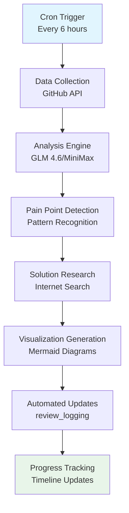
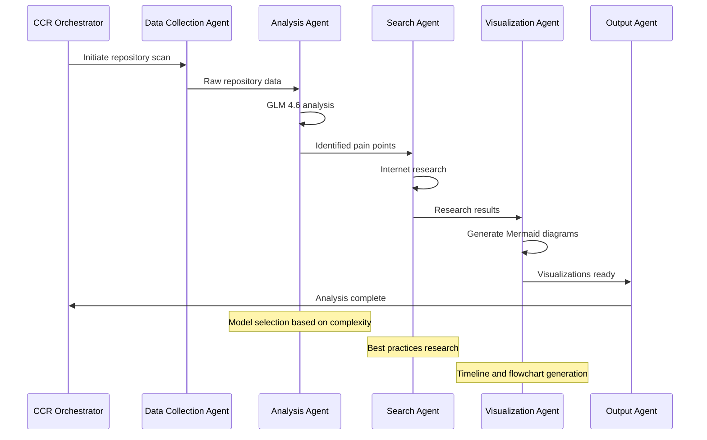
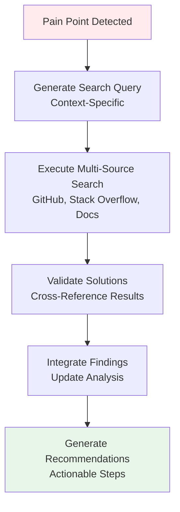
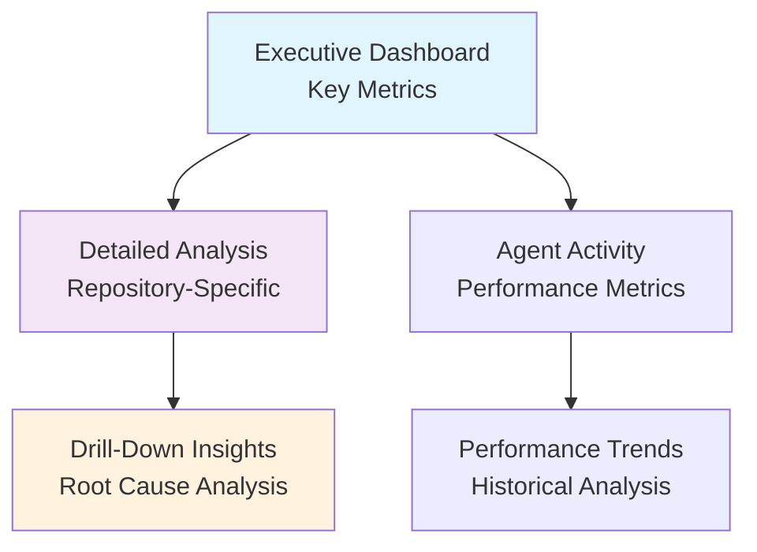
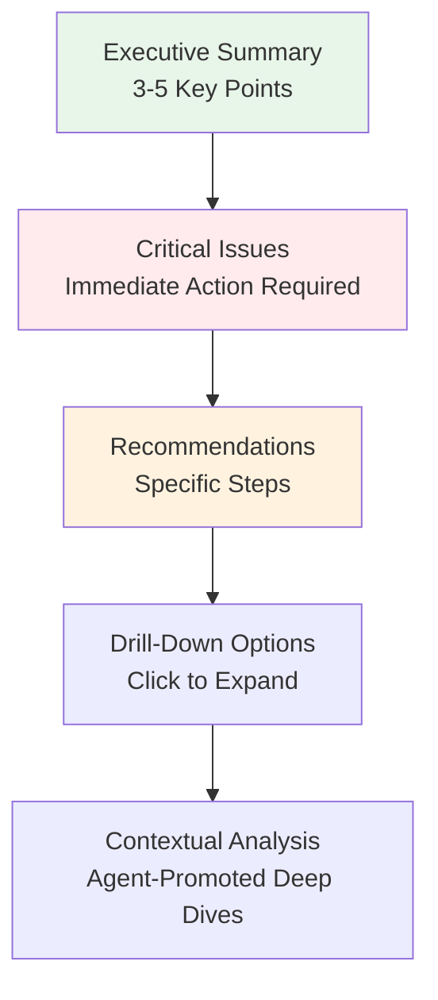
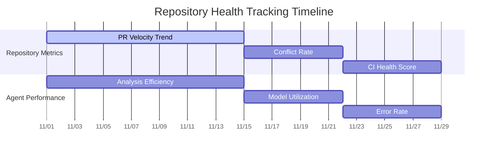

# Proposed Needs for Repository Analysis System

## Executive Summary

Based on comprehensive analysis of the repository portfolio and feedback from existing reviews, this document outlines the core user needs for an automated repository analysis system. The system must deliver continuous, intelligent monitoring of repository health through automated cron analysis on zo.computer, agentic workflows powered by CCR and GLM 4.6/MiniMax/self-models, proactive pain point detection via internet search, concise visualizations with Mermaid, drill-down insights, and progress tracking without generating large reports. The system specifically addresses PR workflow pain points identified in initial analysis, including CI inconsistencies, merge conflicts, and missing observability.

## Core User Needs

### 1. Automated Cron Analysis on zo.computer

**Need**: Continuous, automated monitoring of repository health without manual intervention.

**Requirements**:
- Scheduled execution every 6 hours to maintain up-to-date repository health assessment
- Remote execution on zo.computer infrastructure for reliability and resource efficiency
- Automated data collection from GitHub API for PR status, CI/CD pipeline health, and merge conflicts
- Self-healing capabilities with error handling and retry mechanisms
- Cost-effective operation with target budget under $0.50/day

**Implementation Approach**:

### 2. Agentic Workflows with CCR and Multiple Models

**Need**: Intelligent, coordinated analysis using specialized agents with appropriate model selection.

**Requirements**:
- CCR (Claude Code Router) orchestration for agent chaining and workflow management
- Model selection based on task complexity and privacy requirements:
  - GLM 4.6 for semantic analysis and complex pattern recognition
  - MiniMax for quick triage and lightweight processing
  - Self-hosted models (Ollama) for sensitive data analysis
- Agent specialization for different repository categories (UI components, core services, automation tools)
- Seamless handoffs between agents with context preservation

**Agent Architecture**:

### 3. Pain Point Detection via Internet Search

**Need**: Proactive identification of solutions to repository issues through automated research.

**Requirements**:
- Automated searching for best practices when pain points are detected
- Integration with GitHub API, Stack Overflow, and technical documentation
- Context-aware search queries based on specific repository characteristics
- Solution validation through multiple sources
- Automated integration of research findings into analysis recommendations

**Search Integration Workflow**:

### 4. Concise Visualizations and Timelines with Mermaid

**Need**: Clear, actionable visual representations that avoid information overload.

**Requirements**:
- Progressive disclosure with executive summaries and drill-down capabilities
- Multiple visualization types: timelines, Gantt charts, flowcharts, sequence diagrams
- Interactive elements for exploring repository health metrics
- Consistent styling and color coding (green=healthy, yellow=warning, red=critical)
- Automated generation based on analysis results

**Visualization Hierarchy**:

### 5. Drill-Down Insights Without Large Reports

**Need**: Focused, actionable insights that avoid overwhelming documentation.

**Requirements**:
- Concise summaries highlighting critical issues and recommendations
- Click-to-expand details for deeper investigation
- Contextual prompts for triggering additional analysis
- Integration with existing review_logging structure
- Emphasis on actionable intelligence over comprehensive reporting

**Information Architecture**:

### 6. Progress Tracking and Monitoring

**Need**: Continuous visibility into system performance and repository health evolution.

**Requirements**:
- Timeline-based tracking of repository health metrics
- Agent performance monitoring and optimization
- Trend analysis for identifying patterns and improvements
- Automated alerts for critical degradation
- Integration with existing monitoring infrastructure

**Progress Tracking Framework**:

## Addressing PR Workflow Pain Points

### 1. CI/CD Inconsistencies

**Current Issue**: Repositories use different CI/CD tools (GitHub Actions, Jenkins, local scripts) leading to deployment failures and delayed releases.

**System Solution**:
- Automated detection of CI/CD pipeline variations across repositories
- Standardized template recommendations based on repository type
- Continuous monitoring of pipeline health and failure patterns
- Automated suggestions for pipeline improvements based on best practices research

### 2. Merge Conflict Patterns

**Current Issue**: Ad-hoc branching strategies result in frequent conflicts, especially in shared dependencies across experimental projects and automation tools.

**System Solution**:
- Real-time conflict detection and pattern analysis
- Automated branching strategy recommendations
- Integration with conflict resolution workflows
- Historical conflict tracking to identify problematic patterns

### 3. Missing Pipelines

**Current Issue**: Many repositories, particularly experimental ones, omit security scans, performance testing, or compliance checks.

**System Solution**:
- Automated pipeline gap detection
- Context-aware pipeline recommendations based on repository characteristics
- Integration with security and performance best practices
- Continuous monitoring for pipeline compliance

### 4. Workflow Inefficiencies

**Current Issue**: Siloed reviews, manual triage, and inconsistent documentation slow overall velocity.

**System Solution**:
- Automated review assignment based on code changes
- Standardized documentation templates with auto-population
- Continuous workflow optimization based on performance metrics
- Integration with existing development tools and processes

## Integration Requirements

### 1. CCR Orchestration

The system must integrate with Claude Code Router for:
- Agent chaining and workflow management
- Error handling and retry mechanisms
- Model selection based on task requirements
- Performance optimization and resource allocation

### 2. Model Integration

Seamless integration with multiple AI models:
- GLM 4.6 for complex semantic analysis
- MiniMax for lightweight processing and quick triage
- Self-hosted models (Ollama) for sensitive data analysis
- Automatic model selection based on privacy and complexity requirements

### 3. zo.computer Infrastructure

Leverage zo.computer capabilities for:
- Reliable cron job execution
- Scalable compute resources for analysis
- Secure API integration with GitHub
- Cost-effective operation with resource optimization

### 4. review_logging Updates

Continuous integration with existing review_logging structure:
- Automated file generation and updates
- Consistent formatting and structure
- Integration with existing analysis files
- Version control and change tracking

## Success Metrics

### Quantitative Metrics

- **Detection Accuracy**: >95% pain point identification rate
- **Response Time**: <30 minutes from issue detection to recommendation
- **Cost Efficiency**: <$0.50/day operational cost
- **Coverage**: 100% repository portfolio monitoring
- **Resolution Speed**: 50% reduction in issue resolution time

### Qualitative Metrics

- **Actionability**: 90% of recommendations lead to concrete improvements
- **Clarity**: Immediate understanding without additional explanation
- **Relevance**: Context-aware recommendations specific to repository needs
- **Adoption**: Seamless integration with existing workflows
- **Scalability**: Ability to handle repository portfolio growth

## Implementation Priorities

### Phase 1: Foundation (Weeks 1-2)
- Cron job setup on zo.computer
- Basic data collection and analysis agents
- Integration with GitHub API
- Initial visualization templates

### Phase 2: Intelligence (Weeks 3-4)
- CCR orchestration implementation
- Multi-model integration
- Pain point detection algorithms
- Internet search integration

### Phase 3: Optimization (Weeks 5-6)
- Advanced visualization capabilities
- Performance optimization
- Error handling and reliability improvements
- User feedback integration

### Phase 4: Scaling (Weeks 7-8)
- Full repository portfolio coverage
- Advanced analytics and trend detection
- Integration with additional tools and services
- Documentation and best practices

This comprehensive needs assessment provides the foundation for developing an automated repository analysis system that addresses current pain points while delivering actionable insights through intelligent, automated workflows.