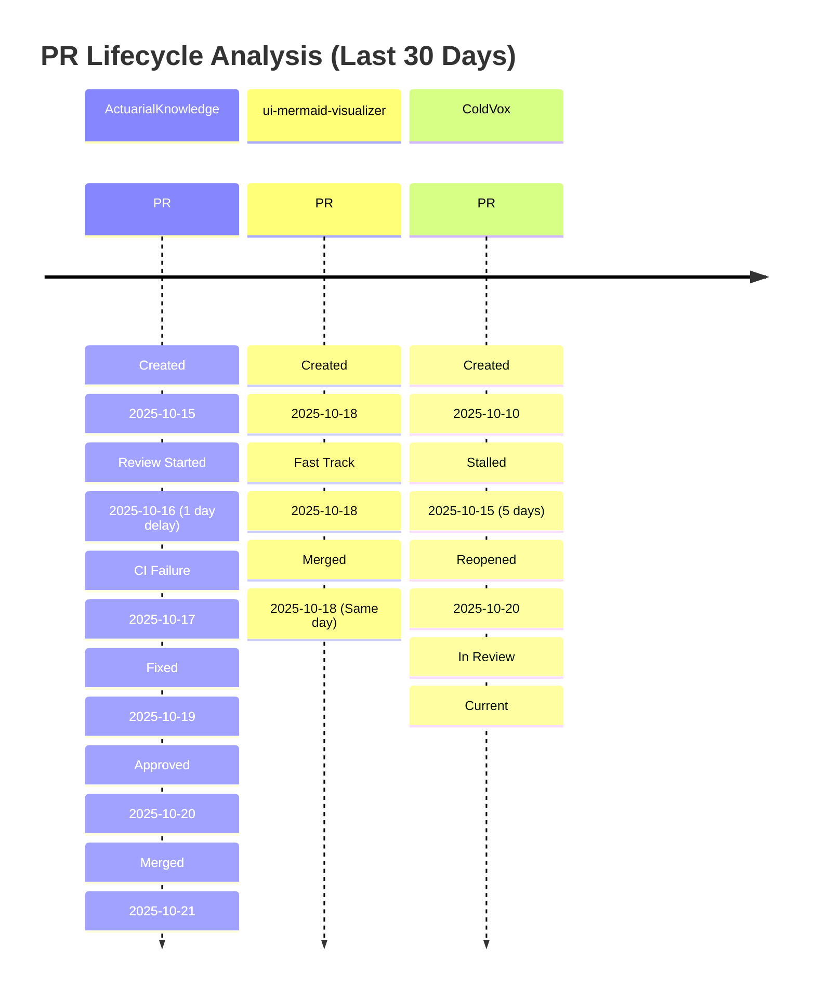
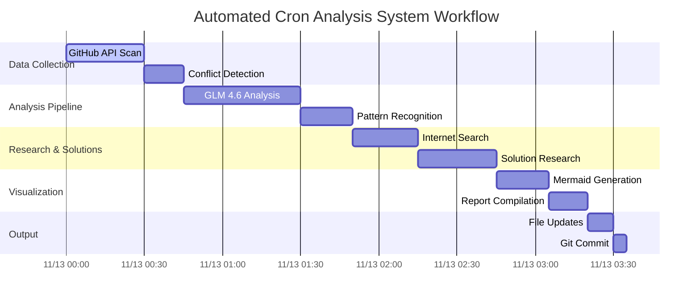
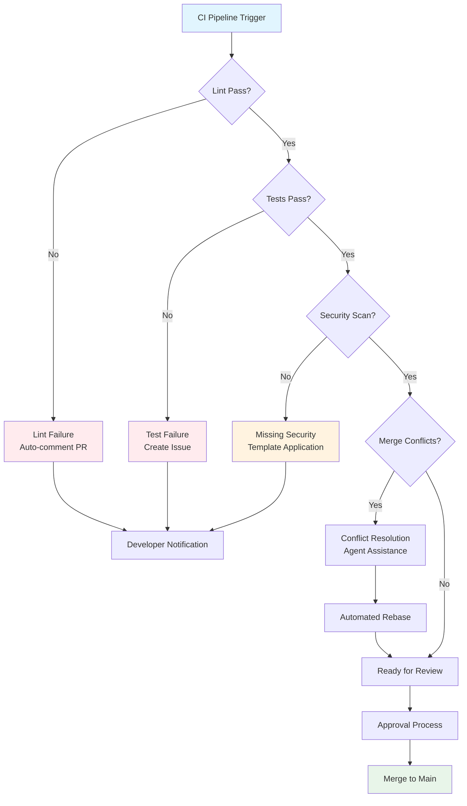
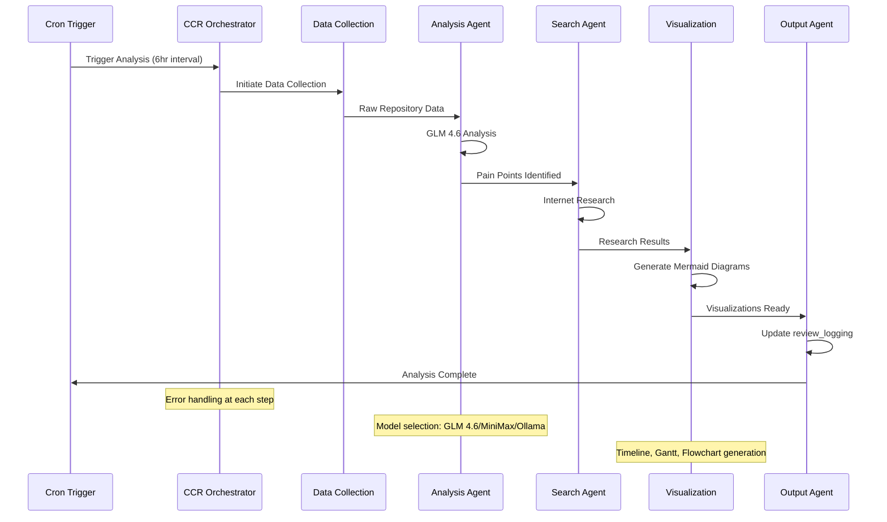
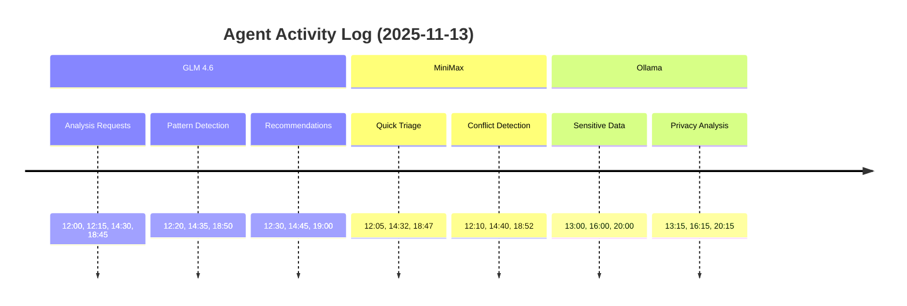
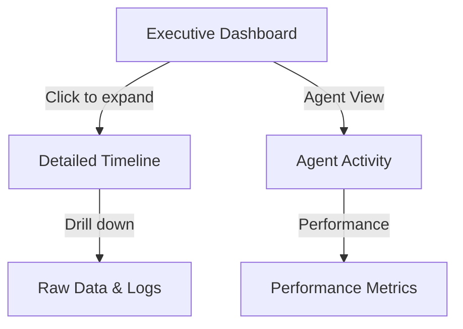
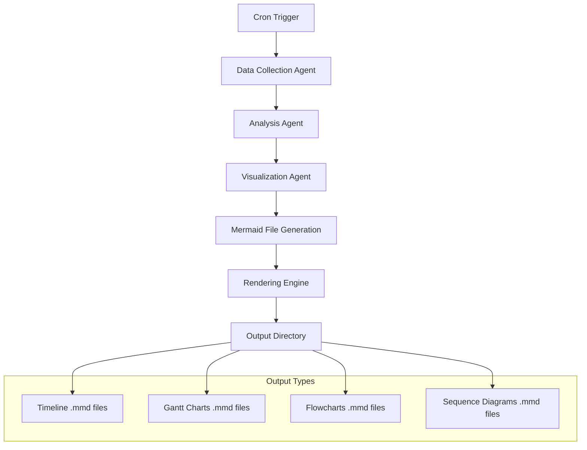

# Visual Timeline Proposals for Repository Analysis System

## Overview of Visual Strategy

The repository analysis system requires concise, actionable visual representations that transform complex data into immediately understandable insights. Our visual strategy focuses on leveraging Mermaid's 2025 features to create drill-down capable, interactive timelines that avoid information overload while providing comprehensive coverage of repository health metrics.

### Core Principles

1. **Progressive Disclosure**: High-level summaries with expandable details
2. **Temporal Context**: All visuals anchored to specific timeframes
3. **Action Orientation**: Visuals directly tied to remediation actions
4. **Pattern Recognition**: Emphasize recurring issues and trends
5. **Multi-dimensional Analysis**: Combine quantitative metrics with qualitative insights

### Visual Hierarchy

- **Level 1**: Executive dashboard with key metrics and trend indicators
- **Level 2**: Detailed timelines for specific pain points or repositories
- **Level 3**: Deep-dive flowcharts for complex workflows or agent interactions
- **Level 4**: Raw data tables and logs for forensic analysis

## Mermaid Examples

### 1. PR Progress Timeline



### 2. Agent Workflow Gantt Chart



### 3. Pain Point Flowchart



### 4. Agent Chaining Sequence Diagram



### 5. Repository Health Heatmap

```mermaid
xychart-beta
    title Repository Health Metrics (Last 7 Days)
    x-axis ["Mon", "Tue", "Wed", "Thu", "Fri", "Sat", "Sun"]
    y-axis "Issues" 0 --> 15
    line [12, 8, 15, 6, 9, 3, 2]
    bar [5, 3, 8, 2, 4, 1, 0]
```

### 6. Agent Activity Timeline



## Conciseness Guidelines

### 1. Information Density Management

**Maximum Elements Per Visualization**:
- Timeline: 5-7 key events per repository
- Gantt: 10-12 concurrent tasks maximum
- Flowchart: 15-20 nodes with clear decision points
- Sequence: 6-8 participants with focused interactions

**Progressive Disclosure Implementation**:


### 2. Key Metrics Focus

**Critical Indicators**:
- PR Velocity: Average time from creation to merge
- Conflict Rate: Percentage of PRs with merge conflicts
- CI Health: Success/failure rates across repositories
- Agent Efficiency: Processing time and accuracy metrics
- Resolution Speed: Time from issue detection to resolution

**Visual Simplification Techniques**:
- Color coding: Green (healthy), Yellow (warning), Red (critical)
- Iconography: Standard symbols for common events
- Temporal compression: Group similar events within time windows
- Threshold highlighting: Emphasize metrics exceeding defined limits

### 3. Interactive Element Design

**Clickable Components**:
- Repository names link to detailed repository views
- Timeline events expand to show full context
- Agent nodes display processing details and model used
- Pain point indicators reveal remediation suggestions

**Hover Information**:
- Quick stats on repository health
- Agent performance metrics
- Historical trend data
- Related issues and dependencies

## Integration with Automated System

### 1. File Generation Pipeline



### 2. Directory Structure

```
review_logging/
├── visualizations/
│   ├── 2025-11-13/
│   │   ├── pr-timeline.mmd
│   │   ├── agent-workflow-gantt.mmd
│   │   ├── pain-points-flowchart.mmd
│   │   └── agent-chaining-sequence.mmd
│   ├── 2025-11-07/
│   └── 2025-11-01/
├── rendered/
│   ├── 2025-11-13/
│   │   ├── pr-timeline.svg
│   │   ├── agent-workflow-gantt.png
│   │   ├── pain-points-flowchart.svg
│   │   └── agent-chaining-sequence.png
│   └── ...
└── summaries/
    ├── 2025-11-13-executive-summary.md
    └── 2025-11-13-detailed-report.md
```

### 3. Automated Rendering Process

**Command Integration**:
```bash
# Generate SVG from Mermaid
mmdc -i pr-timeline.mmd -o pr-timeline.svg -t dark -w 1200 -H 800

# Generate PNG for reports
mmdc -i agent-workflow-gantt.mmd -o agent-workflow-gantt.png -t neutral

# Batch process all diagrams
for file in *.mmd; do
    mmdc -i "$file" -o "${file%.mmd}.svg"
done
```

### 4. Markdown Integration

**Automatic Embedding**:
```markdown
## PR Analysis Timeline - November 13, 2025


### Key Insights
- **Critical Issue**: 3 PRs stalled > 5 days in ColdVox
- **Positive Trend**: ui-mermaid-visualizer showing 24h average merge time
- **Action Required**: Review branching strategy for experimental repos

[View Detailed Analysis](visualizations/2025-11-13/pr-timeline.mmd)
```

## Side Agent Prompt Template

### 1. Insight Detection Prompt

```markdown
You are an Insight Detection Agent for the repository analysis system. Your task is to identify the most important, actionable insights from the collected data that warrant visual representation.

**Input Data**:
- Repository metrics: {{REPOSITORY_METRICS}}
- PR workflow data: {{PR_DATA}}
- Agent performance logs: {{AGENT_LOGS}}
- Historical trends: {{TREND_DATA}}

**Analysis Criteria**:
1. **Impact**: How significantly does this affect development velocity?
2. **Frequency**: Is this a recurring pattern or isolated incident?
3. **Actionability**: Can this be addressed with concrete steps?
4. **Visual Value**: Would visualization enhance understanding?

**Output Format**:
```json
{
  "priority_insights": [
    {
      "title": "Brief descriptive title",
      "severity": "critical|warning|info",
      "repositories": ["repo1", "repo2"],
      "recommendation": "Specific action to take",
      "visual_type": "timeline|gantt|flowchart|sequence",
      "data_points": ["key metrics to visualize"],
      "timeline_context": "last_7_days|last_30_days|custom_range"
    }
  ],
  "trending_patterns": [
    {
      "pattern": "Description of recurring issue",
      "frequency": "daily|weekly|monthly",
      "trend": "improving|stable|degrading",
      "visual_priority": "high|medium|low"
    }
  ]
}
```

Focus on insights that would benefit most from visual representation and immediate attention.
```

### 2. Visualization Selection Prompt

```markdown
You are a Visualization Selection Agent. Given repository analysis insights, determine the optimal Mermaid visualization type and structure.

**Input Insights**: {{INSIGHTS_DATA}}

**Visualization Options**:
1. **Timeline**: Best for sequential events, PR lifecycles, agent activity
2. **Gantt**: Ideal for workflow scheduling, agent coordination, task dependencies
3. **Flowchart**: Perfect for decision processes, pain point resolution, CI/CD flows
4. **Sequence**: Optimal for agent interactions, API calls, system communications
5. **XY Chart**: Best for metrics over time, health indicators, performance trends

**Selection Criteria**:
- Temporal vs. relational data emphasis
- Number of entities involved
- Need for dependency visualization
- Audience technical level

**Output**:
```json
{
  "visualizations": [
    {
      "type": "timeline|gantt|flowchart|sequence|xychart",
      "title": "Descriptive title",
      "focus": "Primary insight this visualization conveys",
      "data_structure": {
        "entities": ["list of main entities"],
        "timeframe": "appropriate time range",
        "key_metrics": ["important metrics to highlight"],
        "interactions": ["important relationships to show"]
      },
      "complexity": "simple|medium|complex",
      "drill_down_potential": "high|medium|low"
    }
  ]
}
```

Choose the visualization type that most effectively communicates the insight while maintaining clarity and conciseness.
```

### 3. Mermaid Generation Prompt

```markdown
You are a Mermaid Generation Agent. Convert visualization specifications into clean, effective Mermaid code following best practices.

**Visualization Specification**: {{VIS_SPEC}}

**Mermaid Requirements**:
1. Use 2025 Mermaid features for enhanced interactivity
2. Implement progressive disclosure where appropriate
3. Apply consistent color scheme and styling
4. Include meaningful labels and annotations
5. Optimize for both readability and rendering performance

**Code Standards**:
- Maximum 20 nodes for flowcharts
- Clear section divisions for timelines
- Consistent time formatting (YYYY-MM-DD HH:mm)
- Descriptive but concise labels
- Proper styling for different element types

**Output**:
```mermaid
[Generate clean, well-structured Mermaid code here]
```

Ensure the generated code renders correctly and effectively communicates the intended insight.
```

### 4. Quality Assurance Prompt

```markdown
You are a Visualization Quality Assurance Agent. Review generated Mermaid visualizations for effectiveness, accuracy, and clarity.

**Generated Visualization**: {{MERMAID_CODE}}
**Original Insight**: {{ORIGINAL_INSIGHT}}

**Quality Checklist**:
1. **Accuracy**: Does the visualization correctly represent the data?
2. **Clarity**: Is the insight immediately understandable?
3. **Completeness**: Are all important elements included?
4. **Conciseness**: Is there any unnecessary complexity?
5. **Visual Appeal**: Is the styling professional and consistent?
6. **Interactivity**: Are clickable elements properly implemented?

**Scoring** (1-10 for each category):
- Accuracy: {{SCORE}}
- Clarity: {{SCORE}}
- Completeness: {{SCORE}}
- Conciseness: {{SCORE}}
- Visual Appeal: {{SCORE}}
- Interactivity: {{SCORE}}

**Overall Score**: {{AVERAGE}}

**Recommendations**:
- [Specific improvements needed]
- [Elements to add/remove]
- [Styling adjustments]

**Output**:
```json
{
  "approved": true/false,
  "score": {{OVERALL_SCORE}},
  "improvements": ["list of specific changes"],
  "final_mermaid": "[improved code if needed]"
}
```

Only approve visualizations that meet all quality standards and effectively communicate the intended insights.
```

## Implementation Timeline

### Phase 1: Foundation (Week 1-2)
- Set up visualization generation pipeline
- Implement basic timeline and flowchart templates
- Create directory structure for outputs
- Test automated rendering process

### Phase 2: Enhancement (Week 3-4)
- Add interactive elements and drill-down capabilities
- Implement agent activity visualizations
- Create quality assurance prompts
- Develop executive dashboard templates

### Phase 3: Integration (Week 5-6)
- Integrate with existing cron system
- Implement side agent for insight detection
- Create automated report generation
- Test end-to-end pipeline

### Phase 4: Optimization (Week 7-8)
- Optimize rendering performance
- Refine visual based on user feedback
- Add advanced visualization types
- Document best practices

## Success Metrics

### Quantitative Metrics
- Visualization generation time: < 2 minutes per analysis
- File size optimization: < 50KB per rendered SVG
- Rendering success rate: > 99%
- User engagement: > 80% of generated visuals viewed

### Qualitative Metrics
- Insight clarity: Immediate understanding without explanation
- Action orientation: 90% of visuals lead to specific actions
- Pattern recognition: Clear identification of trends
- Decision support: Reduced time for repository health assessment

This comprehensive visual timeline strategy transforms complex repository data into actionable insights while maintaining the conciseness and clarity essential for effective decision-making.