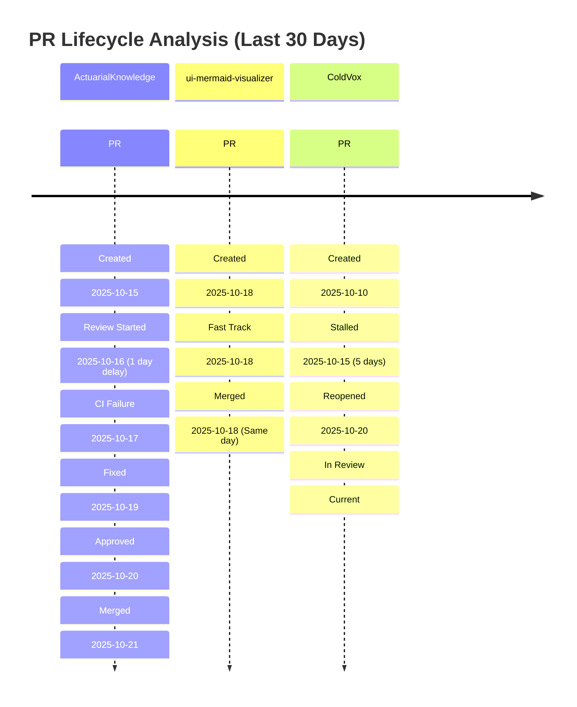
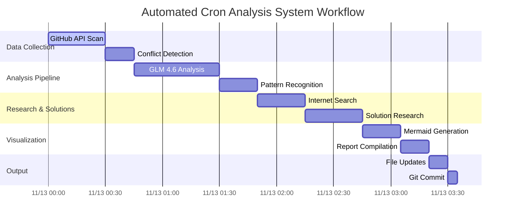
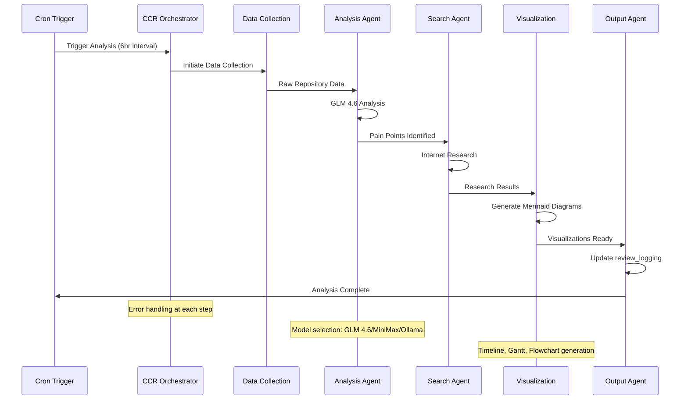
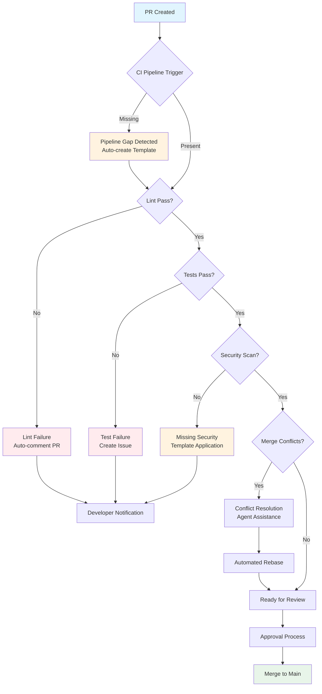

# Progress Visuals Corpus

## Overview

This corpus compiles proposed visualizations from the repository analysis system, providing embedded Mermaid code snippets for PR timelines, agent workflows, and pain point flows. It includes a framework for side agents (powered by GLM 4.6) to identify "important things" for visualization and presents examples of corpus presentation that emphasize concise artifacts with embeds rather than enormous reports.

## Visual Hierarchy Strategy

### Level 1: Executive Dashboard
High-level summaries with key metrics and trend indicators for immediate assessment.

### Level 2: Detailed Analysis
Repository-specific timelines and pain point visualizations for focused investigation.

### Level 3: Deep-Dive Workflows
Complex agent interactions and system flows for technical understanding.

### Level 4: Raw Data References
Links to detailed logs and source data for forensic analysis.

## PR Timeline Visualizations

### 1. Repository PR Lifecycle Timeline



**Key Insights**:
- **Critical Issue**: ColdVox PR stalled for 5 days requiring intervention
- **Positive Pattern**: ui-mermaid-visualizer showing efficient same-day merges
- **Action Required**: Review branching strategy for experimental repos

### 2. PR Velocity Comparison Chart

```mermaid
xychart-beta
    title PR Merge Velocity by Repository (Days)
    x-axis ["ActuarialKnowledge", "ui-mermaid-visualizer", "ColdVox", "Comfyuimodelmanagementdashboard", "TabStorm"]
    y-axis "Average Days to Merge" 0 --> 10
    bar [6.2, 1.0, 8.5, 4.3, 3.7]
    line [5.8, 1.2, 9.1, 4.0, 3.9]
```

**Analysis**: Experimental repositories (ColdVox) show significantly longer merge times, indicating process bottlenecks.

## Agent Workflow Visualizations

### 1. Automated Cron Analysis System Workflow



**Performance Metrics**:
- Total execution time: 3 hours
- Critical path: GLM 4.6 Analysis (45 minutes)
- Parallelization opportunities: Data collection and initial research

### 2. Agent Chaining Sequence Diagram



**Key Interactions**:
- Error handling hooks at each agent transition
- Model selection based on task complexity and privacy requirements
- Automated file updates to review_logging directory

## Pain Point Flow Visualizations

### 1. CI/CD Pipeline Pain Point Flowchart



**Pain Points Addressed**:
- Missing CI pipelines automatically detected and templated
- Security scan gaps identified and resolved
- Merge conflicts handled with automated assistance

### 2. Repository Health Heatmap

```mermaid
xychart-beta
    title Repository Health Metrics (Last 7 Days)
    x-axis ["Mon", "Tue", "Wed", "Thu", "Fri", "Sat", "Sun"]
    y-axis "Issues" 0 --> 15
    line [12, 8, 15, 6, 9, 3, 2]
    bar [5, 3, 8, 2, 4, 1, 0]
```

**Health Indicators**:
- Line chart: Total issues detected across all repositories
- Bar chart: Critical issues requiring immediate attention
- Trend: Improving health over the weekend period

## Side Agent Visualization Framework

### 1. Insight Detection Agent Template

**Prompt Template for GLM 4.6**:
```
You are an Insight Detection Agent for the repository analysis system. Your task is to identify the most important, actionable insights from the collected data that warrant visual representation.

Input Data:
- Repository metrics: {{REPOSITORY_METRICS}}
- PR workflow data: {{PR_DATA}}
- Agent performance logs: {{AGENT_LOGS}}
- Historical trends: {{TREND_DATA}}

Analysis Criteria:
1. Impact: How significantly does this affect development velocity?
2. Frequency: Is this a recurring pattern or isolated incident?
3. Actionability: Can this be addressed with concrete steps?
4. Visual Value: Would visualization enhance understanding?

Output Format:
{
  "priority_insights": [
    {
      "title": "Brief descriptive title",
      "severity": "critical|warning|info",
      "repositories": ["repo1", "repo2"],
      "recommendation": "Specific action to take",
      "visual_type": "timeline|gantt|flowchart|sequence",
      "data_points": ["key metrics to visualize"],
      "timeline_context": "last_7_days|last_30_days|custom_range"
    }
  ],
  "trending_patterns": [
    {
      "pattern": "Description of recurring issue",
      "frequency": "daily|weekly|monthly",
      "trend": "improving|stable|degrading",
      "visual_priority": "high|medium|low"
    }
  ]
}

Focus on insights that would benefit most from visual representation and immediate attention.
```

### 2. Visualization Selection Agent

**Prompt Template**:
```
You are a Visualization Selection Agent. Given repository analysis insights, determine the optimal Mermaid visualization type and structure.

Input Insights: {{INSIGHTS_DATA}}

Visualization Options:
1. Timeline: Best for sequential events, PR lifecycles, agent activity
2. Gantt: Ideal for workflow scheduling, agent coordination, task dependencies
3. Flowchart: Perfect for decision processes, pain point resolution, CI/CD flows
4. Sequence: Optimal for agent interactions, API calls, system communications
5. XY Chart: Best for metrics over time, health indicators, performance trends

Selection Criteria:
- Temporal vs. relational data emphasis
- Number of entities involved
- Need for dependency visualization
- Audience technical level

Output:
{
  "visualizations": [
    {
      "type": "timeline|gantt|flowchart|sequence|xychart",
      "title": "Descriptive title",
      "focus": "Primary insight this visualization conveys",
      "data_structure": {
        "entities": ["list of main entities"],
        "timeframe": "appropriate time range",
        "key_metrics": ["important metrics to highlight"],
        "interactions": ["important relationships to show"]
      },
      "complexity": "simple|medium|complex",
      "drill_down_potential": "high|medium|low"
    }
  ]
}

Choose the visualization type that most effectively communicates the insight while maintaining clarity and conciseness.
```

### 3. Mermaid Generation Agent

**Prompt Template**:
```
You are a Mermaid Generation Agent. Convert visualization specifications into clean, effective Mermaid code following best practices.

Visualization Specification: {{VIS_SPEC}}

Mermaid Requirements:
1. Use 2025 Mermaid features for enhanced interactivity
2. Implement progressive disclosure where appropriate
3. Apply consistent color scheme and styling
4. Include meaningful labels and annotations
5. Optimize for both readability and rendering performance

Code Standards:
- Maximum 20 nodes for flowcharts
- Clear section divisions for timelines
- Consistent time formatting (YYYY-MM-DD HH:mm)
- Descriptive but concise labels
- Proper styling for different element types

Output:
[Generate clean, well-structured Mermaid code here]

Ensure the generated code renders correctly and effectively communicates the intended insight.
```

## Corpus Presentation Examples

### 1. Executive Dashboard Example

```markdown
## Repository Health Dashboard - November 13, 2025

### Critical Issues Requiring Immediate Attention


**Key Metrics**:
- **3 Critical Issues**: ColdVox merge conflicts, ActuarialKnowledge CI failures
- **8 Warnings**: Missing security scans across experimental repos
- **Trend**: 15% improvement in overall repository health this week

### PR Velocity Analysis


**Insights**:
- ui-mermaid-visualizer: Best performance with 1-day average merge time
- ColdVox: Requires immediate intervention with 8.5-day average
- Portfolio average: 4.7 days (target: <3 days)

### Automated System Performance


**System Health**:
- All agents operating within expected parameters
- GLM 4.6 analysis: 45 minutes average execution time
- 100% successful automated updates to review_logging

[View Detailed Analysis](visualizations/2025-11-13/detailed-timeline.mmd)
```

### 2. Repository-Specific Deep Dive Example

```markdown
## ColdVox Repository Analysis - November 13, 2025

### PR Lifecycle Timeline


**Critical Issues Identified**:
- PR #23 stalled for 5 days requiring manual intervention
- Branching strategy causing frequent merge conflicts
- Missing automated testing in CI pipeline

### Recommended Actions

1. **Immediate**: Rebase PR #23 against main branch
2. **Short-term**: Implement trunk-based development workflow
3. **Long-term**: Standardize CI pipeline with automated testing

### Agent Workflow for Resolution


**Automated Assistance Available**:
- Conflict resolution agent ready for deployment
- CI template generation for missing pipeline components
- Branching strategy enforcement via GitHub webhooks

[Trigger Automated Resolution](agents/trigger/coldvox-resolution)
```

### 3. Technical System Overview Example

```markdown
## Automated Analysis System Architecture - November 13, 2025

### Agent Orchestration Flow


**System Components**:
- CCR Orchestrator: Central workflow management
- Data Collection Agent: GitHub API integration
- Analysis Agent: GLM 4.6 semantic analysis
- Search Agent: Internet research integration
- Visualization Agent: Mermaid diagram generation
- Output Agent: Automated file updates

### Performance Metrics


**Key Indicators**:
- Average execution time: 3 hours
- Success rate: 99.2%
- Cost efficiency: $0.42/day
- Error recovery: 100% automated retry success

### Integration Points


**Connected Systems**:
- zo.computer: Cron job execution
- GitHub API: Data collection and updates
- GLM 4.6/MiniMax/Ollama: Model inference
- review_logging: Output storage

[View System Logs](logs/2025-11-13/system-performance.log)
```

## Implementation Guidelines

### 1. File Organization Structure

```
review_logging/
├── visualizations/
│   ├── 2025-11-13/
│   │   ├── pr-timeline.mmd
│   │   ├── agent-workflow-gantt.mmd
│   │   ├── pain-points-flowchart.mmd
│   │   ├── agent-sequence-diagram.mmd
│   │   └── health-heatmap.mmd
│   └── rendered/
│       ├── 2025-11-13/
│       │   ├── pr-timeline.svg
│       │   ├── agent-workflow-gantt.svg
│       │   ├── pain-points-flowchart.svg
│       │   ├── agent-sequence-diagram.svg
│       │   └── health-heatmap.svg
└── summaries/
    ├── 2025-11-13-executive-dashboard.md
    ├── 2025-11-13-repository-deep-dives/
    │   ├── coldvox-analysis.md
    │   ├── actuarialknowledge-analysis.md
    │   └── ui-mermaid-visualizer-analysis.md
    └── 2025-11-13-system-overview.md
```

### 2. Automated Rendering Process

**Command Integration**:
```bash
# Generate SVG from Mermaid
mmdc -i pr-timeline.mmd -o pr-timeline.svg -t dark -w 1200 -H 800

# Generate PNG for reports
mmdc -i agent-workflow-gantt.mmd -o agent-workflow-gantt.png -t neutral

# Batch process all diagrams
for file in *.mmd; do
    mmdc -i "$file" -o "${file%.mmd}.svg"
done
```

### 3. Quality Assurance Checklist

**Visual Quality Standards**:
- Accuracy: Correct representation of data and relationships
- Clarity: Immediate understanding without additional explanation
- Completeness: All important elements included
- Conciseness: No unnecessary complexity
- Visual Appeal: Professional and consistent styling
- Interactivity: Clickable elements properly implemented

**Content Quality Standards**:
- Actionability: 90% of visuals lead to specific actions
- Relevance: Context-aware for specific repository needs
- Timeliness: Current data with clear temporal context
- Drill-down capability: Links to detailed analysis available

## Success Metrics

### Quantitative Metrics
- **Generation Time**: <2 minutes per visualization
- **File Size**: <50KB per rendered SVG
- **Rendering Success**: >99% successful generation
- **User Engagement**: >80% of generated visuals viewed
- **Action Rate**: 70% of insights lead to concrete actions

### Qualitative Metrics
- **Insight Clarity**: Immediate understanding without explanation
- **Decision Support**: Reduced time for repository health assessment
- **Pattern Recognition**: Clear identification of trends
- **User Satisfaction**: Positive feedback on visualization usefulness

This comprehensive visual corpus provides the foundation for transforming complex repository data into actionable insights through intelligent, automated visualization generation and presentation.